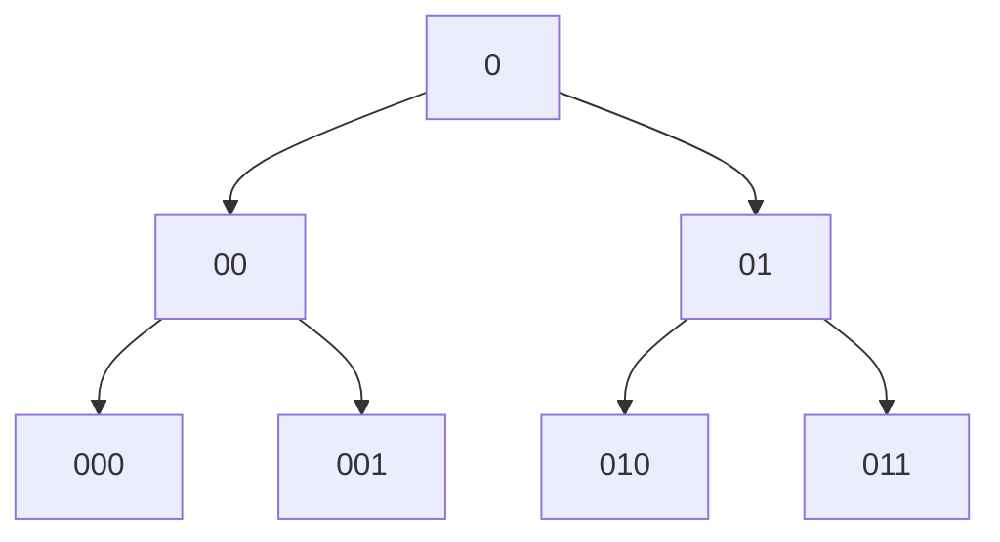

データ構造編の最後は**木とグラフ**です。「グラフ問題は難しそう」と身構える人が多いのですが、コーディングテストで必要な道具は驚くほど少ない——**持ち方1つ**（隣接リスト）と**探索2つ**（DFS/BFS）だけです。

## グラフを構成する語彙

グラフは**頂点**（ノード）と、頂点同士をつなぐ**辺**（エッジ）でできています。

- **無向グラフ** — 辺に向きがない（友達関係）
- **有向グラフ** — 辺に向きがある（フォロー関係）
- **木** — 閉路のない連結グラフ。N頂点なら辺はN-1本
- **連結** — すべての頂点が辺をたどって行き来できる状態

問題文では「N個の都市とM本の道路」「人物AとBは友人」のような姿で登場します。**「〇〇と△△がつながっている」という関係の集まりが出たらグラフ**です。

## グラフの持ち方: 隣接リスト

コードでグラフを扱うには、まず入力をデータ構造に変換します。実戦ではほぼ一択で**隣接リスト**——「各頂点について、隣の頂点の一覧を持つ」形式を使います。

```typescript
// N頂点、辺のリスト edges = [[0,1], [0,2], [1,3]] （無向）
const graph: number[][] = Array.from({ length: N }, () => []);
for (const [a, b] of edges) {
  graph[a].push(b);
  graph[b].push(a);   // 無向なら両方向に張る（有向ならこの行を消す）
}
// graph[0] → [1, 2]  … 頂点0の隣は1と2
```

<SpeechBubble character="/images/question_woman_04_color.png" name="学習者">
N×Nの表（隣接行列）で持つ方法を本で見たことあるけど、そっちじゃダメなの？
</SpeechBubble>

隣接行列はN ≤ 1,000程度なら使えますが、N = 10^5 だと10^10マスでメモリが即死します。辺の数Mに比例したメモリで済む隣接リストが実戦の標準です。この5行の変換は**グラフ問題の儀式**として体に入れてしまいましょう。

## DFS — 行けるところまで潜る

**DFS**（深さ優先探索）は「行き止まりまで進み、戻って別の道へ」という探索です。再帰で書くのが最も素直です。

> **問題**: N人の人物とM組の友人関係がある。友人の友人まで含めた「グループ」はいくつあるか。（連結成分の数）

```typescript
function countGroups(N: number, graph: number[][]): number {
  const visited = new Array(N).fill(false);

  const dfs = (v: number) => {
    visited[v] = true;
    for (const next of graph[v]) {
      if (!visited[next]) dfs(next);   // 未訪問の隣へ潜る
    }
  };

  let groups = 0;
  for (let v = 0; v < N; v++) {
    if (!visited[v]) {
      groups++;        // 未訪問の頂点 = 新しいグループの発見
      dfs(v);          // そのグループ全体を訪問済みにする
    }
  }
  return groups;
}
```

「全頂点を起点候補にして、未訪問なら成分カウント+1して塗りつぶす」——**連結成分カウント**はグラフ問題の登竜門で、paiza・AtCoder両方で頻出です。

### 再帰の深さに注意

Node.jsの再帰は深さ1万〜数万程度でスタックオーバーフローします。N = 10^5 の一本道グラフだと危険です。その場合は、第5章のスタックを使った**非再帰DFS**に書き換えます。

```typescript
const dfsIterative = (start: number) => {
  const stack = [start];
  visited[start] = true;
  while (stack.length > 0) {
    const v = stack.pop()!;
    for (const next of graph[v]) {
      if (!visited[next]) {
        visited[next] = true;
        stack.push(next);
      }
    }
  }
};
```

この `stack` をキューに変えるだけでBFSになります。その対称性はこのあと詳しく扱います。

## BFS — 近い順に広がる

**BFS**（幅優先探索）は、スタートから「距離1の頂点→距離2の頂点→…」と**近い順**に探索します。第5章のキュー（添字方式）がここで主役になります。

BFSの最大の武器は、**辺の重みがすべて等しいとき、最初に到達した時点の距離が最短距離**だと保証されることです。

> **問題**: 頂点0から各頂点への最短距離（辺の本数）を求めよ。

```typescript
function bfsDistances(N: number, graph: number[][], start: number): number[] {
  const dist = new Array(N).fill(-1);   // -1 = 未到達
  const queue: number[] = [start];
  let head = 0;
  dist[start] = 0;

  while (head < queue.length) {
    const v = queue[head++];
    for (const next of graph[v]) {
      if (dist[next] === -1) {          // distがvisited判定を兼ねる
        dist[next] = dist[v] + 1;
        queue.push(next);
      }
    }
  }
  return dist;
}
```

`dist` 配列が訪問済みチェックと距離記録を兼ねるのがポイントです。前章のグリッド探索も、このBFSの「頂点=マス、辺=上下左右」版でした。**迷路・グリッドの最短手数はBFS**が絶対の定番です。

## DFSとBFSは同じ骨格 — 違いは取り出し方だけ

ここまでDFSとBFSを別々に書きましたが、2つの差は**処理待ちの頂点をどこから取り出すか**の1点しかありません。どちらも「処理待ちの置き場」を持ち、そこから1つ取り出して隣を全部入れる、を繰り返すだけです。置き場がスタック（後入れ先出し）ならDFS、キュー（先入れ先出し）ならBFSになります。

```typescript
// DFS — 置き場はスタック
const stack = [start];
while (stack.length) {
  const node = stack.pop()!;         // 最後に入れたものを取る
  for (const next of children(node)) stack.push(next);
}

// BFS — 置き場はキュー
const queue = [start];
while (queue.length) {
  const node = queue.shift()!;       // 最初に入れたものを取る
  for (const next of children(node)) queue.push(next);
}
```

`pop()` か `shift()` か。違いはそこだけで、ループの形も、隣を入れる処理も同じです。

上の2本は骨格を見せるための最小形なので、実戦に持っていくときは2点直します。1つは `shift()` で、配列の要素を毎回ずらすためO(N)かかります。前掲のBFSのように第5章の添字方式（`queue[head++]`）に置き換えてください。もう1つは `visited` で、これがないと閉路のあるグラフを無限に回り続けます。木は閉路がないので省けているだけです。

<SpeechBubble character="/images/question_woman_04_color.png" name="学習者">
じゃあ再帰で書いたDFSはスタックが出てこないけど、あれは別物なの？
</SpeechBubble>

同じものです。再帰版は**言語の呼び出しスタックを置き場として借りている**だけです。`dfs()` を呼ぶと呼び出し元の位置がスタックに積まれ、`return` で取り出されて戻る——自分で `stack` を用意する代わりに、ランタイムが持っているスタックに乗せています。だから明示的なスタックが要りません。裏を返せば、そのスタックの容量は有限なので、深すぎると前節のオーバーフローが起きます。

### 訪問順はこう変わる

子が2つずつある木で、根を `0`、その子を `00`/`01`、さらにその子を `000`/`001`/`010`/`011` と呼ぶことにします。



- **DFS**: `0, 00, 000, 001, 01, 010, 011`
- **BFS**: `0, 00, 01, 000, 001, 010, 011`

DFSは `00` の子を全部見終えてから `01` に行きます。BFSは `00` と `01` を見てから、その下の階層に降ります。「深さ優先」「幅優先」という名前は、この順番をそのまま言っただけのものです。

なお非再帰DFSで子をそのまま `push` すると、最後に積んだ `01` が先に出るので `0, 01, 011, 010, 00, 001, 000` の順になります。再帰版と同じ「左から」の順に揃えたいときは、子を逆順に積みます。順番を問わない問題なら気にしなくて構いません。

### 事実として押さえる2点

- **最短距離が求まるのはBFSだけ** — BFSは根からの辺の本数が少ない順に訪問する。だから重みが等しいグラフでは、最初に到達した時点が最短になる
- **メモリの食い方が逆** — 再帰DFSが抱えるのは「根から現在地までの深さ」に比例した量。BFSのキューが抱えるのは「同じ深さにある頂点の数」に比例した量。深い木ではDFSが、分岐の多い木ではBFSが不利

逆に言えば、「全部を漏れなく見る」だけが目的で順番を問わない問題——連結成分の判定などは、どちらで書いても正解になります。実際に選ぶ基準を次にまとめます。

## DFSとBFSの使い分け

<Figure src="/images/plan_selection_man_color.png" alt="2つの選択肢を比べる人" width={180}>
どちらも全頂点・全辺を1回ずつ見るO(N + M)。速さではなく「何を求めるか」で選ぶ
</Figure>

| 求めたいもの | 選ぶ探索 | 理由 |
|---|---|---|
| **最短**距離・最小手数（重みなし） | BFS | 近い順に広がるので最初の到達が最短 |
| 連結成分・到達可能性 | どちらでも | 塗りつぶせれば十分 |
| 経路の**全列挙**・バックトラッキング | DFS（再帰） | 「戻る」動きが再帰と相性◎ |
| 木の集計（部分木のサイズなど） | DFS（再帰） | 帰りがけに子の結果を合成できる |

迷ったときの合言葉は「**最短ならBFS、全部見るだけならどちらでも、列挙ならDFS**」です。

## 木の問題はDFSの帰りがけが鍵

木（閉路なし）の問題では、「子の結果を親でまとめる」集計が頻出です。再帰DFSの**戻り値**を使うと自然に書けます。

```typescript
// 各頂点を根とする部分木のサイズを求める
const size = new Array(N).fill(0);
const dfs = (v: number, parent: number): number => {
  let s = 1;                            // 自分自身
  for (const c of graph[v]) {
    if (c !== parent) s += dfs(c, v);   // 子の部分木サイズを合算
  }
  return (size[v] = s);
};
dfs(0, -1);
```

木は閉路がないので、visited配列の代わりに「親に戻らない」（`c !== parent`）だけで探索が成立します。

## この章のパターンの見分け方

| 問題文のシグナル | 使う道具 |
|---|---|
| 「AとBがつながっている」「友人関係」「道路」 | まず隣接リスト化 |
| 「グループはいくつ」「到達できるか」 | DFS/BFSで塗りつぶし（連結成分） |
| 「最短」「最小手数」「最少ターン」（重みなし） | BFS |
| 「迷路」「グリッドで上下左右」 | マスを頂点とみなしてBFS |
| 「部分木の〇〇」「子の合計」 | 再帰DFSの戻り値集計 |

<SpeechBubble character="/images/oksign_man_color.png" name="メンター">
グラフ問題の8割は「隣接リストに変換 → DFSかBFSを貼る」で骨格が完成します。残る2割——辺に重みがある最短路や、つながりの管理を高速化したい場面——は第11章のダイクストラ法とUnion-Findで拾います。
</SpeechBubble>

## まとめ

- グラフは「関係の集まり」。入力を**隣接リスト**に変換するのが儀式
- **DFS**は潜って戻る探索。再帰が素直だが、深いグラフでは非再帰版（スタック）に切り替える
- **BFS**は近い順の探索。**重みなし最短距離**の絶対定番。キューは添字方式で
- 使い分けは「最短ならBFS、列挙ならDFS、塗りつぶしはどちらでも」
- 2つの差は**処理待ちの置き場から取り出す順番だけ**。そこから訪問順とメモリの食い方が決まる
- 木の集計は再帰DFSの戻り値で「子→親」に情報を流す

これでデータ構造編は完了です。次章からPart 3・解法パターン編に入ります。まずはすべての解法の出発点、「全探索」からです。
