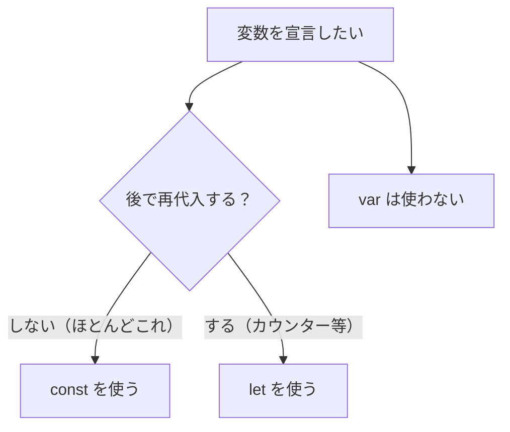

JavaScriptを書きはじめて最初に出会うのが「変数」です。そして最初につまずきやすいのが、変数を宣言する3つのキーワード **`var` / `let` / `const`** の違いです。「結局どれを使えばいいの？」という疑問に、この章ではっきり答えを出します。

あわせて、変数が「どこから見えるか」を決める**スコープ**と、宣言が巻き上げられる**ホイスティング**という、`var` / `let` / `const` の違いの根っこにある仕組みも押さえます。

<SpeechBubble character="/images/usingcomputer_suit_woman_color.png" name="学習者">
  `var`・`let`・`const`
  って3つもあるけど、どれを使えばいいの？サンプルコードによってバラバラで混乱する…。
</SpeechBubble>

先に結論だけ言うと、**「基本は `const`、再代入が必要なときだけ `let`、`var` は使わない」** です。なぜそうなるのかを、これから順に見ていきましょう。

## 変数とは — 値に名前をつける箱

変数は、数値や文字列などの値に**名前をつけて保存しておく仕組み**です。一度名前をつけておけば、後からその名前で値を参照できます。

```js
const name = '太郎';
const age = 25;

console.log(name); // "太郎"
console.log(age); // 25
```

<Figure src="/images/deta_man_color.png" alt="値に名前をつけて保存するイメージ" maxWidth="120px" />

## 3つの宣言方法 — まず全体像

`var` / `let` / `const` の違いを先に表でつかみましょう。詳細はこのあと1つずつ解説します。

| キーワード | 再代入  | 再宣言  | スコープ | 使う？                  |
| ---------- | ------- | ------- | -------- | ----------------------- |
| `const`    | ❌ 不可 | ❌ 不可 | ブロック | ⭕ **基本これ**         |
| `let`      | ⭕ 可   | ❌ 不可 | ブロック | ⭕ 再代入が要るときだけ |
| `var`      | ⭕ 可   | ⭕ 可   | 関数     | ❌ 使わない（古い）     |

## const — 再代入できない（デフォルトで使う）

`const` で宣言した変数には、**後から別の値を代入できません**（再代入不可）。

```js
const tax = 0.1;
tax = 0.08; // ❌ TypeError: Assignment to constant variable.
```

「値が途中で変わらない」ことが保証されるため、コードが読みやすく・安全になります。だからこそ**まず `const` を選ぶ**のが現代の基本方針です。

<SpeechBubble character="/images/oksign_man_color.png" name="先生" side="right">
  「あれ、この変数あとで書き換わるのかな？」と読み手が悩まずに済む。それだけでコードはぐっと読みやすくなるんだ。
</SpeechBubble>

### 注意: constでも「中身」は変えられる

ここが重要な誤解ポイントです。`const` が禁止するのは**変数への再代入**だけです。配列やオブジェクトの**中身（要素・プロパティ）の変更は可能**です。

```js
const user = { name: '太郎' };
user.name = '花子'; // ⭕ OK（プロパティの変更は許される）
user.age = 30; // ⭕ OK

user = { name: '次郎' }; // ❌ NG（変数そのものへの再代入は不可）

const list = [1, 2, 3];
list.push(4); // ⭕ OK（[1, 2, 3, 4] になる）
```

<SpeechBubble character="/images/usingcomputer_suit_woman_color.png" name="学習者">
  `const` の配列に `push` できるの…！？「定数」なのに中身を変えられるのは意外…。
</SpeechBubble>

`const` は「箱の中身を絶対に変えない」ではなく「**箱に入れ替えない**（同じ値を指し続ける）」と捉えると正確です。オブジェクトの場合、「同じオブジェクトを指し続ける」ことは保たれますが、そのオブジェクトの中身は変えられる、というわけです。

## let — 再代入できる

カウンターやループのように、**値を更新していく必要がある**ときは `let` を使います。

```js
let count = 0;
count = count + 1; // ⭕ 再代入OK
count += 1; // ⭕

console.log(count); // 2
```

「この変数は後で変わる」という意図を `let` が示してくれます。逆に言えば、**再代入しない変数にまで `let` を使うと意図がぼやける**ので、迷ったら `const` から始めましょう。

## var — 使わない（古い書き方）

`var` はJavaScript初期からある宣言方法ですが、後述する**スコープの広さ**や**巻き上げ**の挙動が直感に反し、バグの温床でした。`let` / `const`（ES2015で追加）が登場した今、**新しく書くコードで `var` を使う理由はありません**。

<Callout type="warning" title="var は読めれば十分">
  `var`
  は古いコードや記事で見かけるため「読めること」は大切ですが、自分では書かないのが鉄則です。本章では「なぜ避けるのか」を理解するために挙動を解説しますが、結論は一貫して**`var`
  は使わない**です。
</Callout>

## スコープ — 変数が見える範囲

スコープとは、**宣言した変数がどこから参照できるか**の範囲のことです。`let` / `const` と `var` で、この範囲が決定的に違います。

### ブロックスコープ（let / const）

`let` / `const` は、`{ }`（ブロック）の中で宣言すると、**そのブロックの中でしか使えません**。

```js
{
  const message = 'こんにちは';
  console.log(message); // ⭕ "こんにちは"
}
console.log(message); // ❌ ReferenceError: message is not defined
```

`if` 文や `for` 文の `{ }` も同じです。範囲が狭く限定されるので、変数が思わぬ場所から書き換えられる事故を防げます。

### 関数スコープ（var）

一方 `var` は、`{ }` のブロックを無視し、**それを囲む関数全体**で有効になります。

```js
function example() {
  if (true) {
    var x = 1; // ifブロックの中で宣言したのに…
  }
  console.log(x); // 1（関数内ならブロックの外でも見えてしまう）
}
```

<SpeechBubble character="/images/usingcomputer_suit_woman_color.png" name="学習者">
  `if` の中で宣言したのに外から見える…？これは確かに混乱しそう。
</SpeechBubble>

<SpeechBubble character="/images/oksign_man_color.png" name="先生" side="right">
  そう、ここが `var` の罠。`let` / `const`
  なら「宣言したブロックの中だけ」という直感どおりに動くから安全なんだ。
</SpeechBubble>

<Figure
  src="/images/deskwork_check_woman_color.png"
  alt="変数の見える範囲を確認するイメージ"
  maxWidth="120px"
/>

## 巻き上げ（ホイスティング）

JavaScriptでは、変数や関数の宣言が**コードの先頭に引き上げられたかのように扱われます**。これを巻き上げ（hoisting）と呼びます。ここでも `var` と `let` / `const` で挙動が異なります。

### var は undefined で巻き上がる

`var` は宣言が巻き上げられ、**値の代入前でもエラーにならず `undefined`** になります。これがバグを生みます。

```js
console.log(x); // undefined（エラーにならない＝バグに気づきにくい）
var x = 5;
console.log(x); // 5
```

### let / const は「使う前に触るとエラー」

`let` / `const` も巻き上げ自体は起きますが、宣言より前に使おうとすると**エラー**になります。この「宣言前は触れない区間」を **TDZ（Temporal Dead Zone：一時的死角）** と呼びます。

```js
console.log(y); // ❌ ReferenceError: Cannot access 'y' before initialization
let y = 5;
```

<Callout type="note" title="エラーになる方が“安全”">
  一見、`var` のようにエラーにならない方が便利に思えますが、逆です。`let` / `const`
  が「宣言前に使うとエラー」にしてくれるおかげで、**タイプミスや順序の間違いにすぐ気づけます**。バグを早期に発見できるのは大きな利点です。
</Callout>

## 使い分けの結論

ここまでをふまえた実務での判断はシンプルです。



1. **まず `const`** で書く
2. 再代入が必要だと分かったら、その変数だけ `let` に変える
3. `var` は使わない

## 早見表

| 知りたいこと                     | 答え                                             |
| -------------------------------- | ------------------------------------------------ |
| 基本はどれ？                     | `const`                                          |
| 再代入したい                     | `let`                                            |
| `var` は？                       | 使わない                                         |
| `const` の配列に `push` できる？ | できる（中身の変更は可、再代入は不可）           |
| ブロックスコープなのは？         | `let` / `const`                                  |
| 関数スコープなのは？             | `var`                                            |
| 宣言前に使うと？                 | `var`→`undefined` / `let`・`const`→エラー（TDZ） |

## よくあるハマりどころ

<Figure
  src="/images/harry_man_color.png"
  alt="変数まわりのハマりどころに慌てるイメージ"
  maxWidth="120px"
/>

### 1. `const` だから中身も変わらない、という思い込み

前述のとおり、`const` でも配列・オブジェクトの中身は変更できます。「再代入できない」だけだと正確に理解しておきましょう。

### 2. ループ内の `var` で値が共有される

`var` は関数スコープのため、ループで作った関数がすべて**同じ変数**を参照してしまう古典的なバグがあります。`let` ならループごとに別の変数になり、意図どおり動きます。

```js
// ❌ var: すべて 3 が出力される
for (var i = 0; i < 3; i++) {
  setTimeout(() => console.log(i), 0);
}
// 3, 3, 3

// ⭕ let: 0, 1, 2 が出力される
for (let j = 0; j < 3; j++) {
  setTimeout(() => console.log(j), 0);
}
// 0, 1, 2
```

### 3. 同じ名前で再宣言してしまう

`var` は同じ名前で何度でも再宣言できてしまい、うっかり上書き事故が起きます。`let` / `const` は同じスコープでの再宣言をエラーにしてくれるため、ミスに気づけます。

```js
var a = 1;
var a = 2; // ⭕ エラーにならない（危険）

let b = 1;
let b = 2; // ❌ SyntaxError（安全）
```

## DevToolsで変数とスコープを確認する

Chrome DevToolsの **Consoleタブ** と **Sourcesタブ** を使うと、変数のスコープやホイスティングの挙動を実際に確認できます。

### Console で試す

DevTools の Console に直接コードを貼り付けて実行すると、すぐに結果を確認できます。

```js
// Console で実行
const a = 'hello';
let b = 42;
console.log(a, b);

// ブロックスコープの確認
{
  const inner = 'ブロック内';
  console.log(inner); // 表示される
}
console.log(inner); // ReferenceError — ブロックの外からは見えない
```

### Sources タブでブレークポイントを使う

Sources タブでコードの行番号をクリックすると**ブレークポイント**が設定できます。処理がその行で止まり、右側の **Scope** パネルに、その時点で参照できるすべての変数が表示されます。

| Scope のセクション | 内容                             |
| ------------------ | -------------------------------- |
| **Local**          | 現在の関数内のローカル変数       |
| **Block**          | 現在のブロック（`{}`）内の変数   |
| **Closure**        | クロージャで捕捉された外側の変数 |
| **Global**         | グローバルスコープの変数         |

ブレークポイントで止めた状態で Console に変数名を入力すると、その変数の**現在の値**を確認・変更できます。「この変数がここで見えるはず」という想定を、実際に目で確かめる習慣をつけると、スコープの理解が早まります。

## ちゃんと使うためのポイント

- <Marker>宣言は **`const` を基本**にし、再代入が必要なときだけ `let`。`var` は使わない</Marker>
- `const` が禁止するのは**再代入**だけ。配列・オブジェクトの**中身は変更できる**
- `let` / `const` は**ブロックスコープ**（`{ }` の中だけ）、`var` は**関数スコープ**で範囲が広い
- 巻き上げにより、`var` は宣言前でも `undefined`、`let` / `const` は宣言前に使うとエラー（TDZ）
- 「エラーになってくれる」のはバグの早期発見につながる利点

次の章では、変数に入れる「値」そのもの——**[データ型](/books/javascript/02-data-types)** を扱います。文字列・数値・真偽値や `null` / `undefined` の違いを整理し、JavaScriptの土台を固めましょう。

## 参考リンク

- [MDN — const](https://developer.mozilla.org/ja/docs/Web/JavaScript/Reference/Statements/const)
- [MDN — let](https://developer.mozilla.org/ja/docs/Web/JavaScript/Reference/Statements/let)
- [MDN — var](https://developer.mozilla.org/ja/docs/Web/JavaScript/Reference/Statements/var)
- [MDN — 巻き上げ](https://developer.mozilla.org/ja/docs/Glossary/Hoisting)
