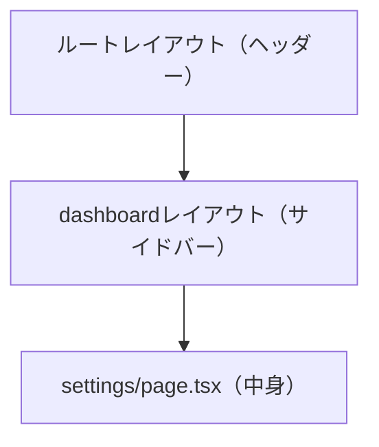

ほとんどのサイトには、全ページ共通のヘッダー・フッター・ナビゲーションがあります。これらをページごとに書いていてはメンテナンスが大変です。App Routerでは **`layout.tsx`** を使って、共通の「枠」を一度だけ定義できます。

この章では、ルートレイアウトとネストレイアウトの仕組み、そして「レイアウトは画面遷移しても再レンダリングされない」という重要な性質を押さえます。

<SpeechBubble character="/images/usingcomputer_suit_woman_color.png" name="学習者">
ヘッダーを全ページに出したいけど、各 `page.tsx` にコピペするのはさすがに違うよね…？
</SpeechBubble>

## layout.tsx の役割 — ページを包む「枠」

`layout.tsx` は、**同じフォルダおよびその配下のすべてのページを包み込む共通UI**を定義します。受け取った `children` の位置に、各ページ（`page.tsx`）の中身が差し込まれます。

```tsx
// src/app/layout.tsx
export default function RootLayout({
  children,
}: {
  children: React.ReactNode;
}) {
  return (
    <html lang="ja">
      <body>
        <header>共通ヘッダー</header>
        <main>{children}</main> {/* ← ここに各ページが入る */}
        <footer>共通フッター</footer>
      </body>
    </html>
  );
}
```

<SpeechBubble character="/images/oksign_man_color.png" name="先生" side="right">
レイアウトは「額縁」、ページは「絵」。額縁はそのままで、中の絵（`children`）だけが差し替わる——このイメージが掴めれば完璧。
</SpeechBubble>

<Figure src="/images/planning_suit_man_color.png" alt="共通の枠の中にページが差し込まれるイメージ" maxWidth="130px" />

## ルートレイアウト — 必須の最上位レイアウト

`app/layout.tsx`（最上位のレイアウト）は **ルートレイアウト**と呼ばれ、App Routerでは**必須**です。アプリ全体の土台になるため、次の特徴があります。

- `<html>` と `<body>` タグを**必ず含める**（他の場所には書かない）
- 全ページで共通の `lang` 属性やグローバルCSSの読み込みをここで行う
- サイト全体のデフォルトのメタデータもここで設定できる（詳細は[第10章](/books/next-js/09-metadata-and-seo)）

```tsx
// src/app/layout.tsx — ルートレイアウト
import "./globals.css";
import type { Metadata } from "next";

export const metadata: Metadata = {
  title: "My App",
  description: "Next.jsで作るアプリ",
};

export default function RootLayout({ children }: { children: React.ReactNode }) {
  return (
    <html lang="ja">
      <body>{children}</body>
    </html>
  );
}
```

## ネストレイアウト — 一部のページにだけ枠を足す

レイアウトは、ルートだけでなく**任意のフォルダ**に置けます。例えば「ダッシュボード配下のページにだけサイドバーを出したい」場合、`app/dashboard/layout.tsx` を作ります。

```
app/
├── layout.tsx              ← ルートレイアウト（全ページ共通）
└── dashboard/
    ├── layout.tsx          ← dashboard配下だけのレイアウト（サイドバー等）
    ├── page.tsx            → /dashboard
    └── settings/
        └── page.tsx        → /dashboard/settings
```

```tsx
// src/app/dashboard/layout.tsx
export default function DashboardLayout({ children }: { children: React.ReactNode }) {
  return (
    <div className="flex">
      <aside className="w-64">サイドバー</aside>
      <div className="flex-1">{children}</div>
    </div>
  );
}
```

このとき、`/dashboard/settings` を開くと、レイアウトは**外側から内側へ入れ子に適用**されます。



<Callout type="info" title="レイアウトの粒度はフォルダ単位で自由">
「この一群のページにだけ共通の枠が欲しい」と思ったら、そのフォルダに `layout.tsx` を足すだけ。`_app.tsx` 1か所で全部を管理していたPages Routerより、はるかに柔軟に共通UIを組めます。
</Callout>

## レイアウトは「再レンダリングされない」

App Routerの重要な性質です。同じレイアウトを共有するページ間を移動しても、**レイアウトは再マウントされず、状態が保持されます**。

例えばダッシュボードのサイドバーに開閉状態を持たせている場合、`/dashboard` から `/dashboard/settings` へ移動してもサイドバーの開閉状態は維持され、`children`（ページの中身）だけが切り替わります。

「再マウントされない」とは、コンポーネントがDOMから外れて作り直されないという意味です。React側の用語としてのマウント・再レンダー・アンマウントは、[Reactのレンダー・マウント・再レンダー・アンマウントの違い](/books/react-learning/03-react-lifecycle)で確認できます。

<SpeechBubble character="/images/usingcomputer_suit_woman_color.png" name="学習者">
ページを移動してもサイドバーのスクロール位置が戻らないの、地味だけど嬉しい…！
</SpeechBubble>

これはユーザー体験に直結する大事な挙動です。ナビゲーションやプレイヤーなど「移動しても状態を保ちたいUI」はレイアウトに置く、と覚えておきましょう。

## template.tsx との違い

レイアウトに似たファイルに `template.tsx` があります。違いは1点だけです。

| ファイル | 画面遷移したとき |
| -------- | ---------------- |
| `layout.tsx` | **再マウントされない**（状態を保持） |
| `template.tsx` | **毎回再マウントされる**（状態リセット・再アニメーション） |

「ページ遷移のたびにフェードインさせたい」「遷移ごとに状態をリセットしたい」といった特殊なケースでは `template.tsx` を使いますが、**基本は `layout.tsx`** で十分です。

## まとめ

- `layout.tsx` は配下のページを包む共通の枠。`children` の位置にページが差し込まれる
- `app/layout.tsx`（ルートレイアウト）は必須で、`<html>` `<body>` を含める
- レイアウトはフォルダ単位で入れ子にでき、外側から内側へ適用される
- 同じレイアウトを共有するページ間の移動では**レイアウトは再レンダリングされず状態を保持**する
- 遷移ごとにリセットしたい特殊なケースだけ `template.tsx` を使う

次の章では、ブログ記事や商品ページのように **[動的ルーティング](/books/next-js/06-dynamic-routes)** でURLの一部を変数として扱う方法を学びます。1つのファイルで何百ページも生成できるようになります。
