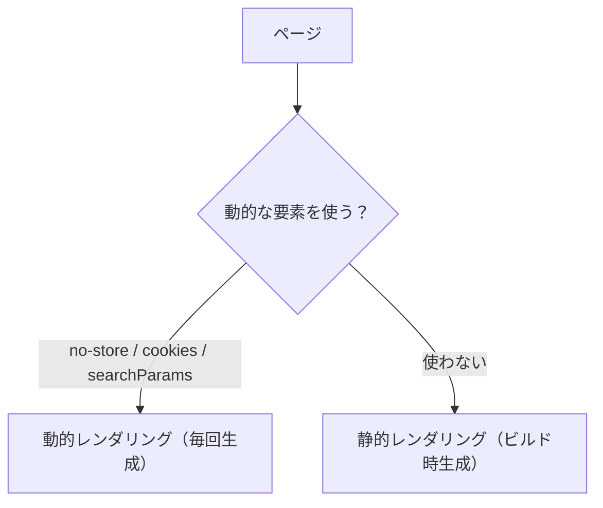

Webアプリの本質は「データを取得して表示する」ことです。Next.js（App Router）では、Server Componentの中で `fetch` を直接 `await` するだけでデータが取れます。さらにNext.jsは `fetch` の結果を**自動でキャッシュ**し、「いつ再取得するか」まで細かく制御できます。

この章では、Server Componentでのデータ取得の基本から、キャッシュと `revalidate`、静的・動的レンダリングの分かれ目までを押さえます。

<SpeechBubble character="/images/usingcomputer_suit_woman_color.png" name="学習者">
Reactだと `useEffect` の中で `fetch` してたけど、Next.jsだと書き方が違うって聞いて混乱してる…。
</SpeechBubble>

## Server Componentでは fetch を直接 await する

[第3章](/books/next-js/03-components)で見たとおり、App RouterのコンポーネントはデフォルトでServer Componentであり、`async` 関数にできます。そのため、`useEffect` や `useState` を使わず、**コンポーネントの中で直接 `await fetch(...)`** できます。

```tsx
// src/app/posts/page.tsx — Server Component
export default async function PostsPage() {
  const res = await fetch("https://api.example.com/posts");
  const posts = await res.json();

  return (
    <ul>
      {posts.map((post: { id: number; title: string }) => (
        <li key={post.id}>{post.title}</li>
      ))}
    </ul>
  );
}
```

<SpeechBubble character="/images/oksign_man_color.png" name="先生" side="right">
`useEffect` での取得は「描画してから取りに行く」。Server Componentは「サーバーで取り終えてから描画する」。だからローディングのちらつきが無く、SEOにも強いんだ。
</SpeechBubble>

<Figure src="/images/deta_man_color.png" alt="サーバーでデータを取得して描画するイメージ" maxWidth="120px" />

<Callout type="info" title="従来のデータ取得との違い">
`getServerSideProps` / `getStaticProps`（Pages Router）のような特別な関数は不要です。App Routerでは「コンポーネント＝データ取得の単位」になり、必要な場所で必要なデータを `fetch` する、というシンプルな形になりました。
</Callout>

## fetch のキャッシュと再検証（revalidate）

Next.jsは標準の `fetch` を拡張しており、**取得結果をキャッシュ**します。どう振る舞わせるかは第2引数のオプションで指定します。

**構文：** `fetch(url, options?)`

| オプション | 指定例 | 挙動 |
| ---------- | ------ | ---- |
| 指定なし | `fetch(url)` | デフォルトでキャッシュされる（同じURLは再取得しない） |
| `cache: 'no-store'` | `fetch(url, { cache: 'no-store' })` | **毎回**取得する（常に最新。キャッシュしない） |
| `next: { revalidate: 秒数 }` | `fetch(url, { next: { revalidate: 60 } })` | 指定秒ごとに再取得（ISR：時間ベースの再検証） |
| `next: { tags: [...] }` | `fetch(url, { next: { tags: ['posts'] } })` | タグを付け、後から `revalidateTag` で再検証できる |

```tsx
// 60秒ごとに最新化（ニュース一覧などに最適）
const res = await fetch("https://api.example.com/posts", {
  next: { revalidate: 60 },
});

// 常に最新が必要（在庫・残高など）
const res2 = await fetch("https://api.example.com/stock", {
  cache: "no-store",
});
```

<SpeechBubble character="/images/usingcomputer_suit_woman_color.png" name="学習者">
キャッシュされるのは速くて嬉しいけど、「更新したのに古いまま」でハマりそう…。
</SpeechBubble>

まさにそこが要注意ポイントです。**「データの鮮度」と「速度」はトレードオフ**です。ほぼ変わらないデータはキャッシュ（または長めの `revalidate`）、刻々と変わるデータは `no-store`、と**データの性質に合わせて選ぶ**のがコツです。

## 静的レンダリングと動的レンダリングの分かれ目

Next.jsは、ページを次のどちらかでレンダリングします。

- **静的レンダリング**：ビルド時にHTMLを生成（高速・CDN配信向き）
- **動的レンダリング**：リクエストごとにサーバーで生成（常に最新）

どちらになるかは**自動で判定**されます。おおまかな基準は次のとおりです。

| こうすると… | レンダリング |
| ------------ | ------------ |
| 通常の `fetch`（キャッシュあり） | 静的 |
| `cache: 'no-store'` を使う | 動的 |
| `cookies()` / `headers()` を読む | 動的 |
| `searchParams` を使う | 動的 |



<Callout type="info" title="まずは意識しすぎなくてよい">
最初のうちは「最新が必要なら `no-store` か短い `revalidate`、そうでなければ何もしない（キャッシュ）」とだけ覚えておけば十分です。挙動が思ったとおりにならないときに、この表に戻ってきてください。
</Callout>

## クエリ文字列を読む — searchParams

`/search?q=nextjs` のような **`?` 以降のクエリ**は、ページの `searchParams` から受け取ります。`params` と同様、**Next.js 15以降は Promise** なので `await` します。

```tsx
// src/app/search/page.tsx
export default async function SearchPage({
  searchParams,
}: {
  searchParams: Promise<{ q?: string }>;
}) {
  const { q } = await searchParams;
  const res = await fetch(`https://api.example.com/search?q=${q ?? ""}`, {
    cache: "no-store",
  });
  const results = await res.json();

  return <p>「{q}」の検索結果: {results.length}件</p>;
}
```

なお `searchParams` を使うとそのページは動的レンダリングになります（検索結果はリクエストごとに変わるため自然な挙動です）。

## 複数のデータを効率よく取る — 並列取得

複数の `fetch` を順番に `await` すると、待ち時間が積み重なって遅くなります（ウォーターフォール）。同時に取れるものは `Promise.all` で**並列化**しましょう。

```tsx
// ❌ 直列：userを待ってからpostsを取る（合計＝両者の和）
const user = await fetch("/api/user").then((r) => r.json());
const posts = await fetch("/api/posts").then((r) => r.json());

// ⭕ 並列：同時に投げて両方待つ（合計＝遅い方だけ）
const [user2, posts2] = await Promise.all([
  fetch("/api/user").then((r) => r.json()),
  fetch("/api/posts").then((r) => r.json()),
]);
```

`Promise.all` の使い方は、JavaScriptの[非同期処理（Promise）](/books/javascript/13-async-callback-promise)で詳しく扱っています。

## まとめ

- Server Componentでは `useEffect` を使わず、コンポーネント内で**直接 `await fetch`**
- `fetch` の結果はデフォルトでキャッシュされる。`cache: 'no-store'` で毎回取得、`next: { revalidate: 秒 }` で定期再取得
- 「鮮度」と「速度」はトレードオフ。データの性質に合わせて選ぶ
- `no-store` / `cookies` / `searchParams` などを使うとページは動的レンダリングになる
- クエリは `searchParams`（`await`）、複数取得は `Promise.all` で並列化

次の章では、Next.jsでAPIエンドポイントを作る **[Route HandlersとAPI Route](/books/next-js/route-handlers)** を扱います。`app/api/.../route.ts` に `GET` や `POST` を定義し、画面ではなくJSONを返す処理を作れるようになります。
