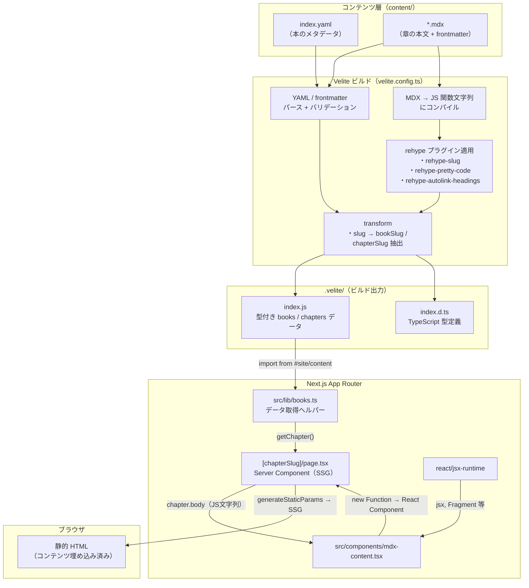

# 教科書（Books）機能 仕様書

## 概要

クイズ（アウトプット）の前段となる「インプット」用の読み物コンテンツ機能。MDX ファイルでコンテンツを管理し、Velite でビルド時に型付きデータへ変換して Next.js の App Router で配信する。DB は使わず、すべてファイルベースで完結する。

> **参考イメージ**: Zenn Books / サバイバルTypeScript

---

## 技術スタック

| ライブラリ | 用途 |
|---|---|
| `velite` (dev) | MDX/YAML の処理、型生成、ビルド時コンテンツ変換 |
| `rehype-pretty-code` (dev) | shiki ベースのシンタックスハイライト（テーマ: `github-dark`） |
| `rehype-slug` (dev) | 見出し要素への ID 自動付与 |
| `rehype-autolink-headings` (dev) | 見出しへのアンカーリンク自動挿入 |
| `@tailwindcss/typography` (dev) | `prose` クラスによる本文の読みやすいスタイリング |

---

## コンテンツの階層構造

```
content/
└── books/
    └── {bookSlug}/          ← 本ごとのディレクトリ
        ├── index.yaml       ← 本のメタデータ（title, description）
        ├── 01-xxx.mdx       ← 第1章
        ├── 02-xxx.mdx       ← 第2章
        └── ...
```

### 本のメタデータ（`index.yaml`）

```yaml
title: "Next.jsからはじめよう"
description: "Reactベースのフレームワーク..."
```

`bookSlug` はディレクトリ名から自動導出される（例: `content/books/nextjs/` → `bookSlug: "nextjs"`）。

### 章の MDX（`*.mdx`）

```yaml
---
title: "Next.jsとは何か"
description: "Next.jsの概要と..."   # 任意
order: 1                            # 章の並び順
---
```

| フィールド | 型 | 必須 | 説明 |
|---|---|---|---|
| `title` | string | はい | 章のタイトル |
| `description` | string | いいえ | 章の概要（メタデータ・目次で使用） |
| `order` | number | はい | 表示順序（昇順ソート） |

ファイル名がそのまま `chapterSlug` になる（例: `01-introduction.mdx` → `chapterSlug: "01-introduction"`）。

---

## ビルドパイプライン

### 全体フロー



### MDXContent 内部の処理フロー

`src/components/mdx-content.tsx` が `chapter.body`（JS 文字列）を React コンポーネントに復元する流れ。

```mermaid
flowchart LR
    A["chapter.body\n（JS関数文字列）"] --> B["new Function(code)\n文字列 → 関数に変換"]
    B --> C["fn&#40;{ jsx, jsxs, Fragment }&#41;\nruntime を渡して実行"]
    C --> D[".default\nReact Component を取得"]
    D --> E["&lt;Component /&gt;\nJSX として描画"]
```



### Velite の統合方式

`next.config.ts` に `VeliteWebpackPlugin` を追加し、Next.js のビルドプロセスに Velite を統合している。開発時は `watch` モードで動作し、MDX の変更がホットリロードされる。

```
Webpack beforeCompile hook
  → velite.build({ watch: dev, clean: !dev })
    → content/ 配下の YAML / MDX を処理
      → .velite/ に型付きデータを出力
```

### 出力

Velite は `.velite/` ディレクトリに以下を生成する。

- `index.js` — books / chapters のデータ（コンパイル済み MDX コード含む）
- `index.d.ts` — TypeScript の型定義

`tsconfig.json` で `#site/content` → `.velite` のパスエイリアスを設定しており、アプリケーションコードからは以下のようにインポートする。

```ts
import { books, chapters } from "#site/content";
```

`.velite/` は `.gitignore` に追加済み。ビルドごとに再生成される。

### MDX → HTML の流れ

Velite の `s.mdx()` スキーマが MDX を JavaScript の関数本体文字列にコンパイルする。章ページでは `MDXContent` コンポーネント（`src/components/mdx-content.tsx`）がこの文字列を `new Function()` で評価し、React コンポーネントとしてレンダリングする。

rehype プラグインはこのコンパイル時に適用される。

- `rehype-slug` — `<h2>`, `<h3>` 等に `id` 属性を付与
- `rehype-pretty-code` — コードブロックを shiki でハイライト
- `rehype-autolink-headings` — 見出しテキストをアンカーリンクでラップ

---

## ルーティングとページ構成

| パス | ファイル | 種別 | 説明 |
|---|---|---|---|
| `/books` | `src/app/books/page.tsx` | Static | 本の一覧ページ |
| `/books/{bookSlug}` | `src/app/books/[bookSlug]/page.tsx` | SSG | 本のトップ（目次 + 読みはじめるボタン） |
| `/books/{bookSlug}/{chapterSlug}` | `src/app/books/[bookSlug]/[chapterSlug]/page.tsx` | SSG | 章の本文 |

`[bookSlug]/page.tsx` と `[chapterSlug]/page.tsx` には `generateStaticParams` を定義しており、ビルド時にすべてのパスを静的生成する。

### レイアウト

`src/app/books/[bookSlug]/layout.tsx` が `bookSlug` 配下のすべてのページにサイドバー付きレイアウトを提供する。

- **デスクトップ** (`lg` 以上) — 左カラムに `BookSidebarDesktop`（幅 256px、`sticky` 配置）
- **モバイル** (`lg` 未満) — 右下の FAB ボタンで `BookSidebarMobile`（shadcn `Sheet` によるドロワー）を開閉

サイドバーは現在のパスに基づいて該当する章をハイライトする（`usePathname` で判定）。

---

## ヘルパー関数

`src/lib/books.ts` に定義。

| 関数 | 戻り値 | 説明 |
|---|---|---|
| `getAllBooks()` | `Book[]` | 全書籍の一覧 |
| `getBook(bookSlug)` | `Book \| undefined` | スラッグで書籍を取得 |
| `getChaptersByBook(bookSlug)` | `Chapter[]` | 書籍の全章を `order` 昇順で取得 |
| `getChapter(bookSlug, chapterSlug)` | `Chapter \| undefined` | 特定の章を取得 |
| `getAdjacentChapters(bookSlug, chapterSlug)` | `{ prev, next }` | 前後の章を取得（先頭・末尾は `null`） |
| `getBookForCategory(categorySlug)` | `Book \| null` | クイズカテゴリに紐づく書籍を取得 |

---

## クイズカテゴリとの連携

`src/lib/books.ts` 内の `categoryToBookMap` で、クイズカテゴリのスラッグと書籍のスラッグを紐づけている。

```ts
const categoryToBookMap: Record<string, string> = {
  nextjs: "nextjs",
  "react-basic": "nextjs",
};
```

対応するエントリがある場合、クイズカテゴリページ（`src/app/quiz/[category]/page.tsx`）のランダムクイズ導線の上に、関連する教科書へのバナーリンクが自動表示される。

ヘッダーナビゲーション（`src/components/HeaderNav.tsx`）には「教科書」リンク（`/books`）を常時表示している。

---

## コンテンツ追加フロー

### 既存の本に章を追加する

該当する本のディレクトリに MDX ファイルを追加する。ファイル名は `{order}-{slug}.mdx` のような命名を推奨するが、Velite はファイル名を直接スラッグとして使うだけなので命名規則に制約はない。`order` フロントマターの値でソートされる。

```
content/books/nextjs/04-routing.mdx   ← 追加
```

```yaml
---
title: "ルーティングの仕組み"
description: "App Router のファイルベースルーティングを解説します。"
order: 4
---
```

開発サーバー起動中であれば Velite の watch モードが検知してホットリロードされる。本番環境では再ビルド（`npm run build`）が必要。

### 新しい本を追加する

`content/books/` 配下に新しいディレクトリを作り、`index.yaml` と最低1つの MDX ファイルを配置する。

```
content/books/typescript/
├── index.yaml
├── 01-what-is-ts.mdx
└── 02-basic-types.mdx
```

コード側の変更は不要。Velite が新しいディレクトリを自動で検出し、`/books/typescript` 以下のルートが生成される。

クイズカテゴリとの連携が必要であれば、`src/lib/books.ts` の `categoryToBookMap` にエントリを追加する。

### カスタム MDX コンポーネントを追加する

`src/components/mdx-content.tsx` の `sharedComponents` オブジェクトにコンポーネントを登録すると、すべての MDX ファイル内で `<ComponentName />` として使用可能になる。

```tsx
import { Callout } from "@/components/Callout";

const sharedComponents = {
  Callout,
};
```

---

## スタイリング

### 本文（prose）

章の本文は `@tailwindcss/typography` の `prose prose-gray` クラスで描画される。Tailwind CSS v4 では `globals.css` に `@plugin "@tailwindcss/typography"` を記載して有効化している。

### コードブロック

`rehype-pretty-code` が生成する `[data-rehype-pretty-code-figure]` セレクタに対してカスタムスタイルを `globals.css` で定義している。テーマは `github-dark`。

### インラインコード

`.prose :not(pre) > code` セレクタで、`var(--muted)` 背景のスタイルを適用している。

---

## 今後の拡張候補

- **進捗管理** — ログインユーザーの既読状態を DB に保存し、サイドバーにチェックマークを表示
- **クイズ導線** — MDX 内に `<QuizLink category="react-basic" />` のようなコンポーネントを埋め込み、該当箇所のクイズへ誘導
- **検索** — Velite の出力からインデックスを生成し、全文検索を提供
- **目次（TOC）** — 各章の見出しから自動生成するサイドバーまたは本文上部の目次
