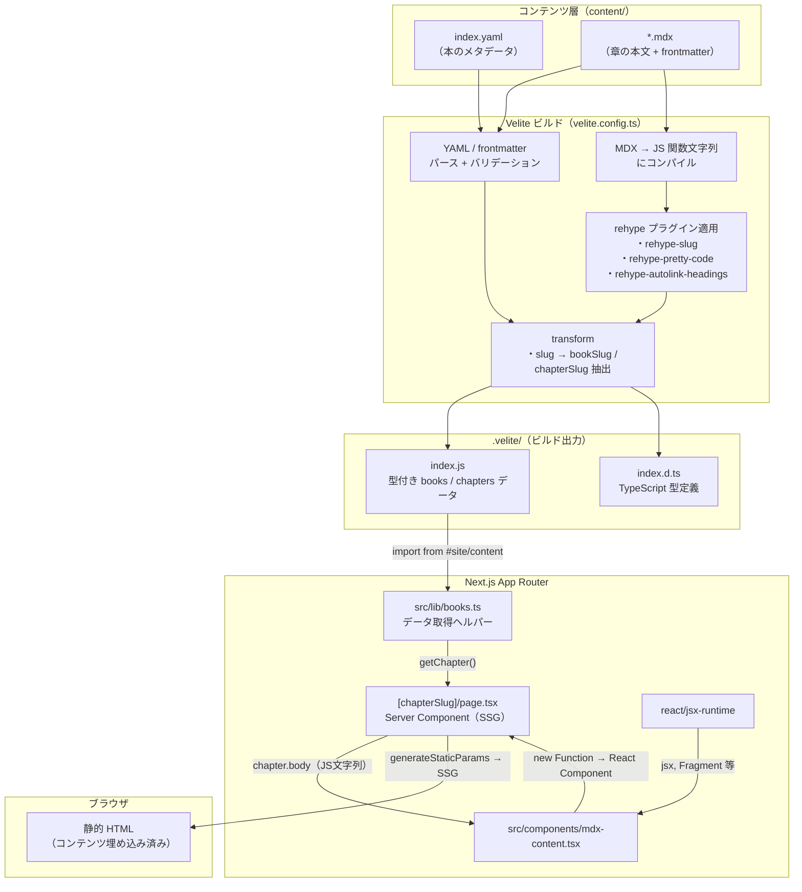

# 教科書（Books）機能 仕様書 & コンテンツ作成ガイド

## 概要

クイズ（アウトプット）の前段となる「インプット」用の読み物コンテンツ機能。MDX ファイルでコンテンツを管理し、Velite でビルド時に型付きデータへ変換して Next.js の App Router で配信する。DB は使わず、すべてファイルベースで完結する。

> **参考イメージ**: Zenn Books / サバイバルTypeScript

---

## 技術スタック

| ライブラリ                       | 用途                                                          |
| -------------------------------- | ------------------------------------------------------------- |
| `velite` (dev)                   | MDX/YAML の処理、型生成、ビルド時コンテンツ変換               |
| `rehype-pretty-code` (dev)       | shiki ベースのシンタックスハイライト（テーマ: `github-dark`） |
| `rehype-slug` (dev)              | 見出し要素への ID 自動付与                                    |
| `rehype-autolink-headings` (dev) | 見出しへのアンカーリンク自動挿入                              |
| `@tailwindcss/typography` (dev)  | `prose` クラスによる本文の読みやすいスタイリング              |

---

## コンテンツの階層構造

```
content/
└── books/
    └── {bookSlug}/          ← 本ごとのディレクトリ
        ├── index.yaml       ← 本のメタデータ（title, description）
        ├── 01-xxx.mdx       ← 第1章
        ├── 02-xxx.mdx       ← 第2章
        └── ...
```

### 本のメタデータ（`index.yaml`）

```yaml
title: 'Next.jsからはじめよう'
description: 'Reactベースのフレームワーク...'
```

`bookSlug` はディレクトリ名から自動導出される（例: `content/books/nextjs/` → `bookSlug: "nextjs"`）。

### 章の MDX（`*.mdx`）

```yaml
---
title: 'Next.jsとは何か'
description: 'Next.jsの概要と...' # 任意
order: 1 # 章の並び順
---
```

| フィールド    | 型     | 必須   | 説明                               |
| ------------- | ------ | ------ | ---------------------------------- |
| `title`       | string | はい   | 章のタイトル                       |
| `description` | string | いいえ | 章の概要（メタデータ・目次で使用） |
| `order`       | number | はい   | 表示順序（昇順ソート）             |

ファイル名がそのまま `chapterSlug` になる（例: `01-introduction.mdx` → `chapterSlug: "01-introduction"`）。

---

## ビルドパイプライン

### 全体フロー



### MDXContent 内部の処理フロー

`src/components/mdx-content.tsx` が `chapter.body`（JS 文字列）を React コンポーネントに復元する流れ。

```mermaid
flowchart LR
    A["chapter.body\n（JS関数文字列）"] --> B["new Function(code)\n文字列 → 関数に変換"]
    B --> C["fn&#40;{ jsx, jsxs, Fragment }&#41;\nruntime を渡して実行"]
    C --> D[".default\nReact Component を取得"]
    D --> E["&lt;Component /&gt;\nJSX として描画"]
```



### Velite の統合方式

`next.config.ts` に `VeliteWebpackPlugin` を追加し、Next.js のビルドプロセスに Velite を統合している。開発時は `watch` モードで動作し、MDX の変更がホットリロードされる。

```
Webpack beforeCompile hook
  → velite.build({ watch: dev, clean: !dev })
    → content/ 配下の YAML / MDX を処理
      → .velite/ に型付きデータを出力
```

### 出力

Velite は `.velite/` ディレクトリに以下を生成する。

- `index.js` — books / chapters のデータ（コンパイル済み MDX コード含む）
- `index.d.ts` — TypeScript の型定義

`tsconfig.json` で `#site/content` → `.velite` のパスエイリアスを設定しており、アプリケーションコードからは以下のようにインポートする。

```ts
import { books, chapters } from '#site/content';
```

`.velite/` は `.gitignore` に追加済み。ビルドごとに再生成される。

### MDX → HTML の流れ

Velite の `s.mdx()` スキーマが MDX を JavaScript の関数本体文字列にコンパイルする。章ページでは `MDXContent` コンポーネント（`src/components/mdx-content.tsx`）がこの文字列を `new Function()` で評価し、React コンポーネントとしてレンダリングする。

rehype プラグインはこのコンパイル時に適用される。

- `rehype-slug` — `<h2>`, `<h3>` 等に `id` 属性を付与
- `rehype-pretty-code` — コードブロックを shiki でハイライト
- `rehype-autolink-headings` — 見出しテキストをアンカーリンクでラップ

---

## ルーティングとページ構成

| パス                              | ファイル                                          | 種別   | 説明                                    |
| --------------------------------- | ------------------------------------------------- | ------ | --------------------------------------- |
| `/books`                          | `src/app/books/page.tsx`                          | Static | 本の一覧ページ                          |
| `/books/{bookSlug}`               | `src/app/books/[bookSlug]/page.tsx`               | SSG    | 本のトップ（目次 + 読みはじめるボタン） |
| `/books/{bookSlug}/{chapterSlug}` | `src/app/books/[bookSlug]/[chapterSlug]/page.tsx` | SSG    | 章の本文                                |

`[bookSlug]/page.tsx` と `[chapterSlug]/page.tsx` には `generateStaticParams` を定義しており、ビルド時にすべてのパスを静的生成する。

### レイアウト

`src/app/books/[bookSlug]/layout.tsx` が `bookSlug` 配下のすべてのページにサイドバー付きレイアウトを提供する。

- **デスクトップ** (`lg` 以上) — 左カラムに `BookSidebarDesktop`（幅 256px、`sticky` 配置）
- **モバイル** (`lg` 未満) — 右下の FAB ボタンで `BookSidebarMobile`（shadcn `Sheet` によるドロワー）を開閉

サイドバーは現在のパスに基づいて該当する章をハイライトする（`usePathname` で判定）。

---

## ヘルパー関数

`src/lib/books.ts` に定義。

| 関数                                         | 戻り値                 | 説明                                  |
| -------------------------------------------- | ---------------------- | ------------------------------------- |
| `getAllBooks()`                              | `Book[]`               | 全書籍の一覧                          |
| `getBook(bookSlug)`                          | `Book \| undefined`    | スラッグで書籍を取得                  |
| `getChaptersByBook(bookSlug)`                | `Chapter[]`            | 書籍の全章を `order` 昇順で取得       |
| `getChapter(bookSlug, chapterSlug)`          | `Chapter \| undefined` | 特定の章を取得                        |
| `getAdjacentChapters(bookSlug, chapterSlug)` | `{ prev, next }`       | 前後の章を取得（先頭・末尾は `null`） |
| `getBookForCategory(categorySlug)`           | `Book \| null`         | クイズカテゴリに紐づく書籍を取得      |

---

## クイズカテゴリとの連携

`src/lib/books.ts` 内の `categoryToBookMap` で、クイズカテゴリのスラッグと書籍のスラッグを紐づけている。

```ts
const categoryToBookMap: Record<string, string> = {
  nextjs: 'nextjs',
  'react-basic': 'nextjs',
};
```

対応するエントリがある場合、クイズカテゴリページ（`src/app/quiz/[category]/page.tsx`）のランダムクイズ導線の上に、関連する教科書へのバナーリンクが自動表示される。

ヘッダーナビゲーション（`src/components/HeaderNav.tsx`）には「教科書」リンク（`/books`）を常時表示している。

---

## コンテンツ追加フロー

### 既存の本に章を追加する

該当する本のディレクトリに MDX ファイルを追加する。ファイル名は `{order}-{slug}.mdx` のような命名を推奨するが、Velite はファイル名を直接スラッグとして使うだけなので命名規則に制約はない。`order` フロントマターの値でソートされる。

```
content/books/nextjs/04-routing.mdx   ← 追加
```

```yaml
---
title: 'ルーティングの仕組み'
description: 'App Router のファイルベースルーティングを解説します。'
order: 4
---
```

開発サーバー起動中であれば Velite の watch モードが検知してホットリロードされる。本番環境では再ビルド（`npm run build`）が必要。

### 新しい本を追加する

`content/books/` 配下に新しいディレクトリを作り、`index.yaml` と最低1つの MDX ファイルを配置する。

```
content/books/typescript/
├── index.yaml
├── 01-what-is-ts.mdx
└── 02-basic-types.mdx
```

コード側の変更は不要。Velite が新しいディレクトリを自動で検出し、`/books/typescript` 以下のルートが生成される。

クイズカテゴリとの連携が必要であれば、`src/lib/books.ts` の `categoryToBookMap` にエントリを追加する。

### 利用可能なカスタム MDX コンポーネント

`src/components/mdx-content.tsx` の `sharedComponents` に登録されているコンポーネントは、すべての MDX ファイル内でそのまま使える。

#### `<Callout>`

補足・注意書きなどを目立たせるボックス。

| prop    | 型                                          | デフォルト          | 説明                                                              |
| ------- | ------------------------------------------- | ------------------- | ----------------------------------------------------------------- |
| `type`  | `'note' \| 'info' \| 'warning' \| 'column'` | `'note'`            | スタイルの種類                                                    |
| `title` | `string`                                    | type に応じた既定値 | ラベルテキスト（省略時は `NOTE` / `INFO` / `WARNING` / `COLUMN`） |

**type の使い分けガイド:**

| type      | 用途                                     | 使いどころの例                                                 |
| --------- | ---------------------------------------- | -------------------------------------------------------------- |
| `note`    | 補足知識・知っておくと便利な情報         | 「Tailwindも内部でCSS変数を使っています」                      |
| `info`    | 具体的なTips・ツールの操作方法           | 「Figmaで色をコピーするとHEX値が取得できます」                 |
| `warning` | ハマりやすい落とし穴・NG例・破壊的操作   | 「!importantの連鎖はCSSを管理不能にします」                    |
| `column`  | 本題から少し外れた背景知識・歴史・コラム | 「マージンの相殺はテキスト文書の段落のために生まれた仕様です」 |

```mdx
<Callout type="note">知っておくと便利な補足情報を書きます。</Callout>

<Callout type="info">具体的なツールの使い方や実務Tipsを書きます。</Callout>

<Callout type="warning">やりがちなミスや注意が必要な操作について書きます。</Callout>

<Callout type="column">本題からは逸れるが知っておくと面白い背景知識やコラムを書きます。</Callout>

<Callout type="info" title="準備中">
  title を指定するとラベルを自由に変えられます。執筆中コンテンツの通知などに。
</Callout>
```

#### `<MermaidDiagram>`

Mermaid 記法の図を描画する。

```mdx
<MermaidDiagram
  chart={`
flowchart LR
    A["作業"] -->|add| B["ステージング"]
    B -->|commit| C["リポジトリ"]
`}
/>
```

#### `<Figure>`

キャプション付きの画像を表示する。
画像はpublic/imagesにあるので、内容に合うものを選んでください。文章ばかり続く時は意識的にイラストを入れてください。

| prop       | 型       | 必須   | 説明                    |
| ---------- | -------- | ------ | ----------------------- |
| `src`      | `string` | はい   | 画像パス                |
| `alt`      | `string` | いいえ | alt テキスト            |
| `maxWidth` | `string` | いいえ | 最大幅（例: `"400px"`） |
| `caption`  | `string` | いいえ | キャプションテキスト    |

```mdx
<Figure src="/images/example.png" alt="例の図" caption="図1: アーキテクチャ概要" maxWidth="600px" />
```

#### 新しいコンポーネントを追加する

`src/components/mdx-content.tsx` の `sharedComponents` オブジェクトに登録すると、すべての MDX で使用可能になる。

```tsx
import NewComponent from '@/app/books/_components/NewComponent';

const sharedComponents = {
  MermaidDiagram,
  Figure,
  Callout,
  NewComponent, // 追加
};
```

---

## スタイリング

### 本文（prose）

章の本文は `@tailwindcss/typography` の `prose prose-gray` クラスで描画される。Tailwind CSS v4 では `globals.css` に `@plugin "@tailwindcss/typography"` を記載して有効化している。

### コードブロック

`rehype-pretty-code` が生成する `[data-rehype-pretty-code-figure]` セレクタに対してカスタムスタイルを `globals.css` で定義している。テーマは `github-dark`。

### インラインコード

`.prose :not(pre) > code` セレクタで、`var(--muted)` 背景のスタイルを適用している。

---

## AIによるコンテンツ作成ガイド

ウェブエンジニア問題集（study.ntorelabo.com）の教科書を、AIに作成・追加してもらうときに使うプロンプトと添付ファイルのリスト。

### 添付ファイルのリスト

#### 毎回必須（仕様理解用）

| ファイル          | パス例                           | 用途                                                   |
| ----------------- | -------------------------------- | ------------------------------------------------------ |
| 仕様書            | `docs/books.md`（本ファイル）    | 本機能の全体仕様                                       |
| Velite設定        | `velite.config.ts`               | frontmatterスキーマ確認                                |
| MDXコンポーネント | `src/components/mdx-content.tsx` | 使えるカスタムコンポーネント（MermaidDiagram等）の把握 |

#### サンプル（トーン参考用）

| ファイル                  | 用途                     |
| ------------------------- | ------------------------ |
| 既存本の `index.yaml` 1つ | メタデータのトーン       |
| 既存本のMDX 1〜2章        | 本文のトーン・構成・粒度 |

#### 任意（SEO戦略を考えてもらう場合）

| ファイル           | 用途                                     |
| ------------------ | ---------------------------------------- |
| `src/lib/books.ts` | categoryToBookMap の現状確認             |
| サイトURL          | カテゴリ構成・既存の本のラインナップ確認 |

---

### パターンA: 新しい本をゼロから作る

```
ウェブエンジニア問題集（https://study.ntorelabo.com/）の教科書コンテンツを
新規で1冊作りたい。

# 前提
- サイトはクイズ中心の学習サイト、教科書はクイズのインプット教材
- 想定読者は駆け出しエンジニア
- SEOはロングテール狙い（章タイトル=具体的な検索クエリ）
- 添付ファイルは本機能の仕様書・Velite設定・既存本のサンプル

# 作りたい本
テーマ: [ここに書く、例: TypeScript入門]
対応クイズカテゴリ: [ここに書く、例: ts-general]
章数: [ここに書く、例: 10章]

# 進め方
1. 本のタイトル案を複数出して
2. 章構成（各章のfrontmatterのtitleをロングテール意識で）を提示して
3. 承認したら執筆開始
4. まず1章だけ書いて、トーン確認後に残りを書く

# 守ってほしい制約
- H1は本文に書かない（H2始まり）
- frontmatterは title / description / order の3つ
- MermaidDiagramが使える（<-->は使わず-->のみ、ラベルは短く）
- 次章への橋渡し文で締める

# 添付ファイル
- docs/books.md（本ファイル）
- velite.config.ts
- mdx-content.tsx
- 既存本のindex.yaml 1つ
- 既存本のMDX 1〜2章（トーン参考）
```

---

### パターンB: 既存の本に章を追加する

```
既存の本に章を1つ追加したい。

# 対象の本
- bookSlug: [例: git]
- 追加したい章のテーマ: [例: git cherry-pickの使い方]
- 章番号: [例: order: 11]

# 添付ファイル
- 追加先の本の既存章MDX 2〜3個（トーン合わせ用）
- docs/books.md（本ファイル）
- velite.config.ts

```

---

### パターンC: テーマ選定から相談したい

```
ウェブエンジニア問題集（https://study.ntorelabo.com/）に新しい教科書を追加したい。
テーマは決まっていないので、SEO観点で勝ちやすいテーマを提案してほしい。

# 前提
- 現在ある本: [例: Next.js、Git]
- 狙いたいSEO戦略: [ロングテール / ビッグワード / 内部回遊重視]
- 避けたい領域: [例: 既に書いたテーマと被るもの]

# やってほしいこと
1. サイトの既存カテゴリを確認（URL渡すので見て）
2. 競合状況を調査
3. 候補テーマを3つ程度、根拠付きで提案
4. 選んだテーマで章構成を設計

# 添付ファイル
- docs/books.md（本ファイル）
- books.ts（categoryToBookMap確認用）
- 既存本のMDX（トーン参考）
```

---

## MDX記述ルール

### frontmatter

```yaml
---
title: '章タイトル（SEO意識・検索クエリとして成立する形）'
description: '1〜2文の説明'
order: 1
---
```

### 本文の構成パターン

```
（本文先頭、H1なし）
導入の1〜2段落

## H2見出し1
（本文・コード・表）

## H2見出し2
（本文・Mermaid図）

...

## よくあるハマりどころ
（実務で遭遇するトラブル集）

## ちゃんと使うためのポイント
- 箇条書きで重要点をまとめ

次の章への橋渡し文
```

### Mermaidの安全な書き方

使える構文:

- `flowchart TB` / `flowchart LR`
- `gitGraph`
- 矢印は `-->` と `---` のみ
- ノード: `A["短いラベル"]`
- エッジラベル: `A -->|ラベル| B`

避けるもの:

- `<-->` などの双方向矢印（MDXがJSXと誤認識する）
- 長い日本語ラベル（改行や崩れの原因）
- 深いsubgraphネスト

### 記述例

```mdx
<MermaidDiagram
  chart={`
flowchart LR
    A["作業"] -->|add| B["ステージング"]
    B -->|commit| C["リポジトリ"]
`}
/>
```

---

## デプロイ後の作業

新しい本を追加したら、以下の3つの設定を更新する。コンテンツファイル（`content/books/`）の追加だけではVeliteが自動検出するが、テーマや表示順はコード側の設定が必要。

### 1. テーマカラーの設定（`src/app/books/page.tsx`）

`bookThemeMap` に新しい本のスラッグとテーマカラーを追加する。未設定の場合は `DEFAULT_THEME`（amber）が使われる。

```ts
const bookThemeMap: Record<string, BookTheme> = {
  // ... 既存のテーマ
  'new-book-slug': {
    cardBg: 'bg-orange-100',      // カードの背景色
    iconBg: 'bg-orange-200',      // アイコンの背景色
    iconText: 'text-orange-700',  // アイコンのテキスト色
    accent: 'text-orange-700',    // アクセント色（「読む →」など）
    accentHover: 'group-hover:text-orange-700',
    badgeBg: 'bg-white',          // 「全N章」バッジの背景
    badgeText: 'text-orange-700', // 「全N章」バッジのテキスト色
  },
};
```

**使用済みの色と対応する本:**

| 色 | Tailwind | 使用中の本 |
|---|---|---|
| 緑 | `emerald` | system-design |
| 黄 | `amber` | javascript |
| 紺 | `indigo` | typescript |
| 水色 | `cyan` | react-learning |
| 青 | `blue` | css-basics |
| 紫 | `violet` | tailwind-css |
| 濃紫 | `purple` | cs-basics |
| グレー | `zinc` | next-js |
| ピンク | `rose` | git-basic |
| スレート | `slate` | unit-testing |
| オレンジ | `orange` | http-and-web-api |
| ティール | `teal` | integration-and-e2e-testing |

新しい本を追加する場合は、上記と被らない色を選ぶ。候補: `red`, `lime`, `sky`, `fuchsia`, `pink` など。

### 2. 表示順の設定（`src/lib/books.ts`）

`BOOK_ORDER` 配列に新しい本のスラッグを追加する。配列の順番がそのまま `/books` ページの表示順になる。未登録の本は末尾に表示される。

```ts
export const BOOK_ORDER = [
  'system-design',
  'http-and-web-api',
  'javascript',
  // ... 追加したい位置に挿入
] as const;
```

### 3. NEW バッジ（`src/lib/books.ts`）

`NEW_BOOK_SLUGS` に追加すると、`/books` ページのカードに NEW バッジ（赤いパルスアニメーション付き）が表示される。一定期間経ったら外す。

```ts
export const NEW_BOOK_SLUGS = new Set<string>(['new-book-slug']);
```

### 4. クイズカテゴリとの連携（`src/lib/books.ts`）

対応するクイズカテゴリがある場合は `categoryToBookMap` に追加する。

```ts
const categoryToBookMap: Record<string, string> = {
  nextjs: 'next-js',
  'react-basic': 'react-learning',
  'new-quiz-category': 'new-book-slug', // 追加例
};
```

これでクイズカテゴリページに教科書バナーが自動表示される。

---

## 今後の拡張候補

- **進捗管理** — ログインユーザーの既読状態を DB に保存し、サイドバーにチェックマークを表示
- **クイズ導線** — MDX 内に `<QuizLink category="react-basic" />` のようなコンポーネントを埋め込み、該当箇所のクイズへ誘導
- **検索** — Velite の出力からインデックスを生成し、全文検索を提供
- **目次（TOC）** — 各章の見出しから自動生成するサイドバーまたは本文上部の目次
