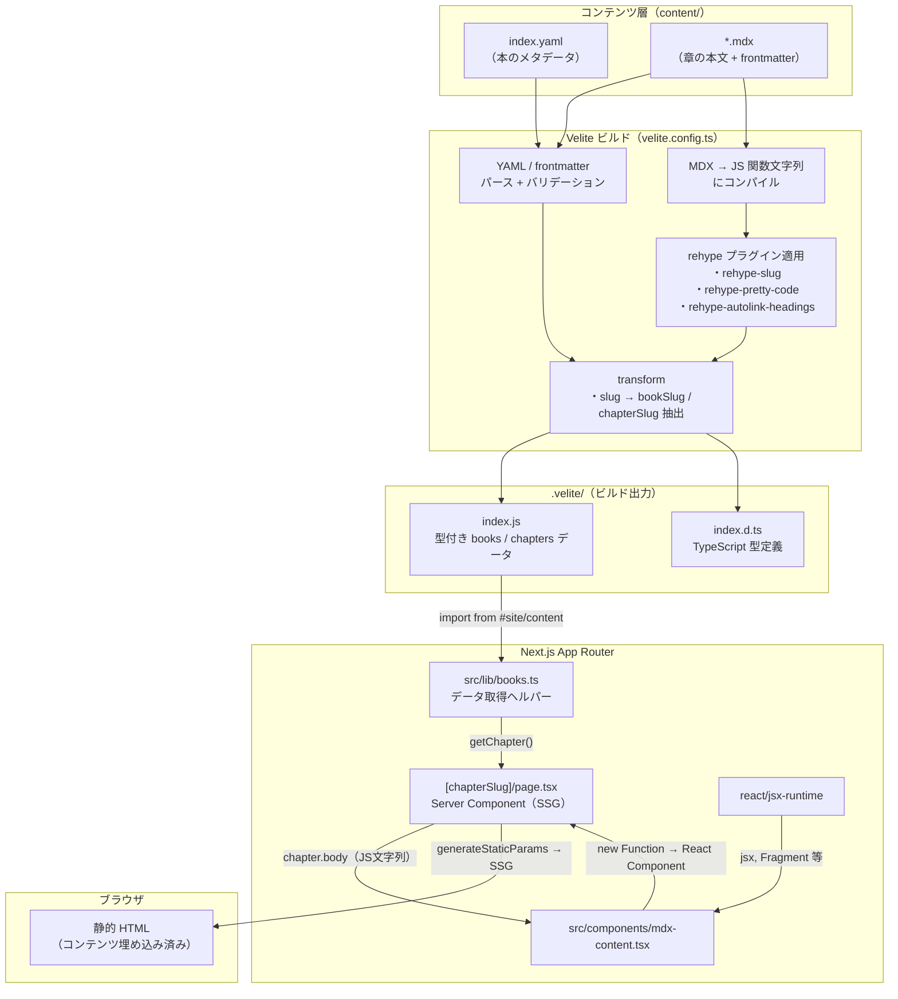

# 教科書（Books）機能 仕様書 & コンテンツ作成ガイド

## 概要

クイズ（アウトプット）の前段となる「インプット」用の読み物コンテンツ機能。MDX ファイルでコンテンツを管理し、Velite でビルド時に型付きデータへ変換して Next.js の App Router で配信する。DB は使わず、すべてファイルベースで完結する。

> **参考イメージ**: Zenn Books / サバイバルTypeScript

---

## 技術スタック

| ライブラリ                       | 用途                                                          |
| -------------------------------- | ------------------------------------------------------------- |
| `velite` (dev)                   | MDX/YAML の処理、型生成、ビルド時コンテンツ変換               |
| `rehype-pretty-code` (dev)       | shiki ベースのシンタックスハイライト（テーマ: `github-dark`） |
| `rehype-slug` (dev)              | 見出し要素への ID 自動付与                                    |
| `rehype-autolink-headings` (dev) | 見出しへのアンカーリンク自動挿入                              |
| `@tailwindcss/typography` (dev)  | `prose` クラスによる本文の読みやすいスタイリング              |

---

## コンテンツの階層構造

```
content/
└── books/
    └── {bookSlug}/          ← 本ごとのディレクトリ
        ├── index.yaml       ← 本のメタデータ（title, description）
        ├── 01-xxx.mdx       ← 第1章
        ├── 02-xxx.mdx       ← 第2章
        └── ...
```

### 本のメタデータ（`index.yaml`）

```yaml
title: 'Next.jsからはじめよう'
description: 'Reactベースのフレームワーク...'
```

`bookSlug` はディレクトリ名から自動導出される（例: `content/books/nextjs/` → `bookSlug: "nextjs"`）。

### 章の MDX（`*.mdx`）

```yaml
---
title: 'Next.jsとは何か'
description: 'Next.jsの概要と...' # 任意
order: 1 # 章の並び順
---
```

| フィールド    | 型     | 必須   | 説明                               |
| ------------- | ------ | ------ | ---------------------------------- |
| `title`       | string | はい   | 章のタイトル                       |
| `description` | string | いいえ | 章の概要（メタデータ・目次で使用） |
| `order`       | number | はい   | 表示順序（昇順ソート）             |

ファイル名がそのまま `chapterSlug` になる（例: `01-introduction.mdx` → `chapterSlug: "01-introduction"`）。

---

## ビルドパイプライン

### 全体フロー



### MDXContent 内部の処理フロー

`src/components/mdx-content.tsx` が `chapter.body`（JS 文字列）を React コンポーネントに復元する流れ。

```mermaid
flowchart LR
    A["chapter.body\n（JS関数文字列）"] --> B["new Function(code)\n文字列 → 関数に変換"]
    B --> C["fn&#40;{ jsx, jsxs, Fragment }&#41;\nruntime を渡して実行"]
    C --> D[".default\nReact Component を取得"]
    D --> E["&lt;Component /&gt;\nJSX として描画"]
```



### Velite の統合方式

`next.config.ts` に `VeliteWebpackPlugin` を追加し、Next.js のビルドプロセスに Velite を統合している。開発時は `watch` モードで動作し、MDX の変更がホットリロードされる。

```
Webpack beforeCompile hook
  → velite.build({ watch: dev, clean: !dev })
    → content/ 配下の YAML / MDX を処理
      → .velite/ に型付きデータを出力
```

### 出力

Velite は `.velite/` ディレクトリに以下を生成する。

- `index.js` — books / chapters のデータ（コンパイル済み MDX コード含む）
- `index.d.ts` — TypeScript の型定義

`tsconfig.json` で `#site/content` → `.velite` のパスエイリアスを設定しており、アプリケーションコードからは以下のようにインポートする。

```ts
import { books, chapters } from '#site/content';
```

`.velite/` は `.gitignore` に追加済み。ビルドごとに再生成される。

### MDX → HTML の流れ

Velite の `s.mdx()` スキーマが MDX を JavaScript の関数本体文字列にコンパイルする。章ページでは `MDXContent` コンポーネント（`src/components/mdx-content.tsx`）がこの文字列を `new Function()` で評価し、React コンポーネントとしてレンダリングする。

rehype プラグインはこのコンパイル時に適用される。

- `rehype-slug` — `<h2>`, `<h3>` 等に `id` 属性を付与
- `rehype-pretty-code` — コードブロックを shiki でハイライト
- `rehype-autolink-headings` — 見出しテキストをアンカーリンクでラップ

---

## ルーティングとページ構成

| パス                              | ファイル                                          | 種別   | 説明                                    |
| --------------------------------- | ------------------------------------------------- | ------ | --------------------------------------- |
| `/books`                          | `src/app/books/page.tsx`                          | Static | 本の一覧ページ                          |
| `/books/{bookSlug}`               | `src/app/books/[bookSlug]/page.tsx`               | SSG    | 本のトップ（目次 + 読みはじめるボタン） |
| `/books/{bookSlug}/{chapterSlug}` | `src/app/books/[bookSlug]/[chapterSlug]/page.tsx` | SSG    | 章の本文                                |

`[bookSlug]/page.tsx` と `[chapterSlug]/page.tsx` には `generateStaticParams` を定義しており、ビルド時にすべてのパスを静的生成する。

### レイアウト

`src/app/books/[bookSlug]/layout.tsx` が `bookSlug` 配下のすべてのページにサイドバー付きレイアウトを提供する。

- **デスクトップ** (`lg` 以上) — 左カラムに `BookSidebarDesktop`（幅 256px、`sticky` 配置）
- **モバイル** (`lg` 未満) — 右下の FAB ボタンで `BookSidebarMobile`（shadcn `Sheet` によるドロワー）を開閉

サイドバーは現在のパスに基づいて該当する章をハイライトする（`usePathname` で判定）。

---

## ヘルパー関数

`src/lib/books.ts` に定義。

| 関数                                         | 戻り値                 | 説明                                  |
| -------------------------------------------- | ---------------------- | ------------------------------------- |
| `getAllBooks()`                              | `Book[]`               | 全書籍の一覧                          |
| `getBook(bookSlug)`                          | `Book \| undefined`    | スラッグで書籍を取得                  |
| `getChaptersByBook(bookSlug)`                | `Chapter[]`            | 書籍の全章を `order` 昇順で取得       |
| `getChapter(bookSlug, chapterSlug)`          | `Chapter \| undefined` | 特定の章を取得                        |
| `getAdjacentChapters(bookSlug, chapterSlug)` | `{ prev, next }`       | 前後の章を取得（先頭・末尾は `null`） |
| `getBookForCategory(categorySlug)`           | `Book \| null`         | クイズカテゴリに紐づく書籍を取得      |

---

## クイズカテゴリとの連携

`src/lib/books.ts` 内の `categoryToBookMap` で、クイズカテゴリのスラッグと書籍のスラッグを紐づけている。

```ts
const categoryToBookMap: Record<string, string> = {
  nextjs: 'nextjs',
  'react-basic': 'nextjs',
};
```

対応するエントリがある場合、クイズカテゴリページ（`src/app/quiz/[category]/page.tsx`）のランダムクイズ導線の上に、関連する教科書へのバナーリンクが自動表示される。

ヘッダーナビゲーション（`src/components/HeaderNav.tsx`）には「教科書」リンク（`/books`）を常時表示している。

---

## コンテンツ追加フロー

### 既存の本に章を追加する

該当する本のディレクトリに MDX ファイルを追加する。Velite はファイル名を直接 `chapterSlug` として使う。章の表示順はファイル名ではなく、frontmatter の `order` でソートされる。

既存章に差し込む場合、**既存ファイル名（= 既存URL）は変更しない**。SEO評価・外部リンク・サイト内リンクを維持するため。

一方で、**これから新しく作る章ファイルには、既存本・新規本を問わず原則として連番を付けない**。Velite はファイル名をそのまま URL の `chapterSlug` にするため、`08-route-handlers.mdx` のように番号を入れると、その番号が URL に残り続ける。章の並び順は frontmatter の `order` で管理し、ファイル名は `route-handlers.mdx` のような意味ベース slug にする。

```
content/books/next-js/route-handlers.mdx   ← 追加
```

```yaml
---
title: 'Route HandlersとAPI Route'
description: 'Next.js App RouterでAPIエンドポイントを作る方法を解説します。'
order: 8
---
```

上記の場合、URL は `/books/next-js/route-handlers` になる。

避ける例:

```
content/books/next-js/08-route-handlers.mdx
content/books/aws-saa-c03/01-iam-and-least-privilege.mdx
```

既存章が `08-loading-and-error.mdx` のような番号付きファイル名でも、新しく追加する章まで番号付きに合わせない。新規本を作る場合も同じで、最初から `01-...mdx`、`02-...mdx` のようにしない。番号はURLに残り続け、章の追加・差し込み・並べ替えに弱くなるため。

既存本へ章を差し込むときの方針:

- 既存ファイル名は変更しない
- 新規ファイル名は既存本・新規本を問わず `route-handlers.mdx` のような意味ベース slug にする
- 新規ファイル名に `01-`、`02-`、`08-` のような並び順の番号を入れない
- 並び順は `order` で調整する
- 章末の「次の章」リンクや本文中の章番号表記だけ更新する

### 関連トピックには詳細ページへのリンクを付ける

本文中で「関連している」「前章で扱った」「詳しくは別章で」と触れる場合は、読者がすぐ移動できるように該当章・該当本へのリンクを付ける。単に「前章」「後述」「関連ページ」と書くだけで終わらせない。

```mdx
良い例:
[Route Handlers](/books/next-js/route-handlers) で作ったAPIは、デプロイ先のランタイムにも影響されます。

避ける例:
前に説明したAPIは、デプロイ先のランタイムにも影響されます。
```

外部サービスや最新仕様に依存する内容（Vercel、Cloudflare、Next.js公式仕様など）を扱う場合は、必要に応じて公式ドキュメントへの外部リンクも付ける。特にデプロイ、料金、ランタイム、対応機能、制限事項は変わりやすいため、本文中で断定しすぎず「公式で確認する」導線を残す。

### 長い章・参照性の高い章には目次を入れる

1ページが長くなる章、または読者が特定項目を探しながら読む章では、冒頭の導入文・吹き出し・画像の後に「目次」を置く。目次は単なる長文対策ではなく、必要な項目へ移動するためのインデックスとして扱う。

日本語見出しや記号入り見出しは自動生成される `id` が読みづらくなったり、変更時にリンクが壊れたりしやすい。目次を置く章では、主要見出しの直前に明示的なアンカーを置くことを推奨する。

```mdx
## 目次

- [Route Handlersとは](#route-handlers-overview)
- [GET — データを取得する](#get)
- [NextRequest — リクエストを扱う](#next-request)

---

<a id="route-handlers-overview"></a>

## Route Handlersとは

...

---

<a id="get"></a>

## GET — データを取得する

...
```

目次を入れる目安:

- `##` 見出しが8個以上ある
- 本文が400行を超える
- 検索流入があり、読者が一部のトピックだけを参照しそうな章
- API、CSSプロパティ、設定項目、ユーティリティ型、配列メソッドなど、辞書的に参照されやすい章
- `Partial` / `Pick` / `ReturnType` のように、独立した項目を横断的に比較・参照する章

開発サーバー起動中であれば Velite の watch モードが検知してホットリロードされる。本番環境では再ビルド（`npm run build`）が必要。

### 新しい本を追加する

`content/books/` 配下に新しいディレクトリを作り、`index.yaml` と最低1つの MDX ファイルを配置する。

```
content/books/typescript/
├── index.yaml
├── 01-what-is-ts.mdx
└── 02-basic-types.mdx
```

コード側の変更は不要。Velite が新しいディレクトリを自動で検出し、`/books/typescript` 以下のルートが生成される。

クイズカテゴリとの連携が必要であれば、`src/lib/books.ts` の `categoryToBookMap` にエントリを追加する。

### 利用可能なカスタム MDX コンポーネント

`src/components/mdx-content.tsx` の `sharedComponents` に登録されているコンポーネントは、すべての MDX ファイル内でそのまま使える。

#### `<Callout>`

補足・注意書きなどを目立たせるボックス。

| prop    | 型                                          | デフォルト          | 説明                                                              |
| ------- | ------------------------------------------- | ------------------- | ----------------------------------------------------------------- |
| `type`  | `'note' \| 'info' \| 'warning' \| 'column'` | `'note'`            | スタイルの種類                                                    |
| `title` | `string`                                    | type に応じた既定値 | ラベルテキスト（省略時は `NOTE` / `INFO` / `WARNING` / `COLUMN`） |

**type の使い分けガイド:**

| type      | 用途                                     | 使いどころの例                                                 |
| --------- | ---------------------------------------- | -------------------------------------------------------------- |
| `note`    | 補足知識・知っておくと便利な情報         | 「Tailwindも内部でCSS変数を使っています」                      |
| `info`    | 具体的なTips・ツールの操作方法           | 「Figmaで色をコピーするとHEX値が取得できます」                 |
| `warning` | ハマりやすい落とし穴・NG例・破壊的操作   | 「!importantの連鎖はCSSを管理不能にします」                    |
| `column`  | 本題から少し外れた背景知識・歴史・コラム | 「マージンの相殺はテキスト文書の段落のために生まれた仕様です」 |

```mdx
<Callout type="note">知っておくと便利な補足情報を書きます。</Callout>

<Callout type="info">具体的なツールの使い方や実務Tipsを書きます。</Callout>

<Callout type="warning">やりがちなミスや注意が必要な操作について書きます。</Callout>

<Callout type="column">本題からは逸れるが知っておくと面白い背景知識やコラムを書きます。</Callout>

<Callout type="info" title="準備中">
  title を指定するとラベルを自由に変えられます。執筆中コンテンツの通知などに。
</Callout>
```

#### `<MermaidDiagram>`

Mermaid 記法の図を描画する。

```mdx
<MermaidDiagram
  chart={`
flowchart LR
    A["作業"] -->|add| B["ステージング"]
    B -->|commit| C["リポジトリ"]
`}
/>
```

#### `<Figure>`

キャプション付きの画像を表示する。
画像は `public/images` にあるので、内容に合うものを選ぶ。文章ばかり続くときは意識的にイラストを入れる。多少内容に合っていなくてもよいので、**同じ画像ばかりに偏らないこと**。1章の中で同じイラストを2回以上使わない。本全体でも、特定の画像に集中しないよう意識してバリエーションを出す

| prop       | 型       | 必須   | 説明                    |
| ---------- | -------- | ------ | ----------------------- |
| `src`      | `string` | はい   | 画像パス                |
| `alt`      | `string` | いいえ | alt テキスト            |
| `maxWidth` | `string` | いいえ | 最大幅（例: `"400px"`） |
| `caption`  | `string` | いいえ | キャプションテキスト    |

```mdx
<Figure src="/images/example.png" alt="例の図" caption="図1: アーキテクチャ概要" maxWidth="600px" />
```

#### `<SpeechBubble>`

キャラクター画像付きの吹き出し。会話形式で初心者の疑問や補足を挟みたいときに使う。`<Callout>` よりカジュアルな印象で、文章が続くときの箸休めにも向く。

| prop        | 型                  | デフォルト | 説明                                          |
| ----------- | ------------------- | ---------- | --------------------------------------------- |
| `character` | `string`            | なし       | キャラ画像のパス（`public/images` 配下）。省略可 |
| `name`      | `string`            | なし       | 話し手の名前（画像の下に小さく表示）。省略可  |
| `side`      | `'left' \| 'right'` | `'left'`   | 吹き出しを左右どちらに出すか                  |

```mdx
<SpeechBubble character="/images/question_woman_04_color.png" name="学習者">
  JSXってHTMLみたいだけど、ブラウザはこれをそのまま読めるの？
</SpeechBubble>

<SpeechBubble character="/images/relief_man_color.png" name="先生" side="right">
  いい質問！実はビルド時にただのJavaScriptへ変換されているんだ。
</SpeechBubble>
```

**積極的に使ってください。** 説明が硬くなりがちな箇所や、読者がつまずきやすいポイントでは、`<Figure>`（イラスト）だけでなくこの吹き出しも織り交ぜると、一気に読みやすくなります。キャラクターは**学習者＝`usingcomputer_suit_woman_color.png`、先生＝`oksign_man_color.png`** にサイト全体で統一しています（先生が安心させる場面では `relief_man_color.png` も可）。

**配置は冒頭に固定しないこと。** 章の導入に「学習者の素朴な疑問」を置くのは“つかみ”として有効ですが、それだけにする必要はありません。むしろ**本文中で対話形式が効く場所に自由に置く**のが本来の使い方です。具体的には:

- 難しい概念の**直前**に「それ、〇〇とどう違うの？」と疑問を置き、直後の本文で答える
- 難しいコード例・図の**直後**に「結局どういうこと？」と挟み、先生がひとことで要約する
- ありがちな誤解・ハマりどころの箇所で「つい〇〇しちゃうけど、ダメなの？」と差し込む
- 「学習者が疑問 → 先生が答える」の往復は、必ずしも連続2連で置かず、**疑問だけ置いて直後の地の文で答える**形でもよい

目安は章あたり2〜4個。使いすぎると逆にうるさくなるので、「ここは言葉で説明するより会話の方が腑に落ちる」と思った箇所に絞って配置します。

#### `<Marker>`

本文中の重要な一文やキーワードに、蛍光ペンのような下線マーカーを付ける。見出しだけでなく、通常の段落内でも使える。

`<Callout>` ほど強い囲みは不要だが、「ここは読者に覚えてほしい」「実務で特に効くポイント」として視線を止めたい場合に使う。

```mdx
<Marker>外部ライブラリの戻り値の型がexportされていない場合でも、ReturnTypeで型を抽出できます。</Marker>
```

段落の一部だけを強調することもできる。

```mdx
実務では、<Marker>型を自分で書き直すより、既存の関数から抽出する</Marker>方が安全な場面があります。
```

`<Marker>` はインライン要素なので、タグの内側で改行・インデントしない。改行を入れると、その空白にもマーカー背景が当たり、細い黄色い点のように見えることがある。

```mdx
<!-- OK -->
<Marker>重要な一文を1行で囲みます。</Marker>

<!-- NG: 改行とインデントにも背景が当たる -->
<Marker>
  重要な一文を囲みます。
</Marker>
```

使いすぎるとページ全体が騒がしくなり、どこが本当に重要なのか分かりにくくなる。1章あたり1〜3箇所程度を目安に、章の中でも特に覚えてほしい箇所に限定する。

#### `<TailwindPreview>`

Tailwindのクラスで作ったUIサンプルを、本文中に実表示するためのプレビュー枠。Tailwind CSS本のように「コードだけでは完成形が想像しにくい」章で使う。

| prop     | 型       | デフォルト  | 説明                 |
| -------- | -------- | ----------- | -------------------- |
| `title`  | `string` | `'Preview'` | プレビュー枠の見出し |
| `children` | `ReactNode` | なし | 表示したいサンプルUI |

```mdx
<TailwindPreview title="ボタンの見た目">
  <div className="flex gap-3">
    <button className="rounded-md bg-blue-600 px-4 py-2 text-sm font-semibold text-white">
      送信
    </button>
    <button className="rounded-md border border-blue-600 px-4 py-2 text-sm font-semibold text-blue-600">
      キャンセル
    </button>
  </div>
</TailwindPreview>
```

実表示サンプルは読者の理解に直結するため、Tailwind・CSS・UIコンポーネント系の章では、主要なコード例の直後に入れる。MDX内ではReact JSXとして書くため、実表示部分は `class` ではなく `className` を使う。

#### 新しいコンポーネントを追加する

`src/components/mdx-content.tsx` の `sharedComponents` オブジェクトに登録すると、すべての MDX で使用可能になる。

```tsx
import NewComponent from '@/app/books/_components/NewComponent';

const sharedComponents = {
  MermaidDiagram,
  Figure,
  Callout,
  SpeechBubble,
  NewComponent, // 追加
};
```

---

## スタイリング

### 本文（prose）

章の本文は `@tailwindcss/typography` の `prose prose-gray` クラスで描画される。Tailwind CSS v4 では `globals.css` に `@plugin "@tailwindcss/typography"` を記載して有効化している。

### コードブロック

`rehype-pretty-code` が生成する `[data-rehype-pretty-code-figure]` セレクタに対してカスタムスタイルを `globals.css` で定義している。テーマは `github-dark`。

### インラインコード

`.prose :not(pre) > code` セレクタで、`var(--muted)` 背景のスタイルを適用している。

---

## AIによるコンテンツ作成ガイド

ウェブエンジニア問題集（study.ntorelabo.com）の教科書を、AIに作成・追加してもらうときに使うプロンプトと添付ファイルのリスト。

### 添付ファイルのリスト

#### 毎回必須（仕様理解用）

| ファイル          | パス例                           | 用途                                                   |
| ----------------- | -------------------------------- | ------------------------------------------------------ |
| 仕様書            | `docs/books.md`（本ファイル）    | 本機能の全体仕様                                       |
| Velite設定        | `velite.config.ts`               | frontmatterスキーマ確認                                |
| MDXコンポーネント | `src/components/mdx-content.tsx` | 使えるカスタムコンポーネント（MermaidDiagram等）の把握 |

#### サンプル（トーン参考用）

| ファイル                  | 用途                     |
| ------------------------- | ------------------------ |
| 既存本の `index.yaml` 1つ | メタデータのトーン       |
| 既存本のMDX 1〜2章        | 本文のトーン・構成・粒度 |

#### 任意（SEO戦略を考えてもらう場合）

| ファイル           | 用途                                     |
| ------------------ | ---------------------------------------- |
| `src/lib/books.ts` | categoryToBookMap の現状確認             |
| サイトURL          | カテゴリ構成・既存の本のラインナップ確認 |

---

### パターンA: 新しい本をゼロから作る

```
ウェブエンジニア問題集（https://study.ntorelabo.com/）の教科書コンテンツを
新規で1冊作りたい。

# 前提
- サイトはクイズ中心の学習サイト、教科書はクイズのインプット教材
- 想定読者は駆け出しエンジニア
- SEOはロングテール狙い（章タイトル=具体的な検索クエリ）
- 添付ファイルは本機能の仕様書・Velite設定・既存本のサンプル

# 作りたい本
テーマ: [ここに書く、例: TypeScript入門]
対応クイズカテゴリ: [ここに書く、例: ts-general]
章数: [ここに書く、例: 10章]

# 進め方
1. 本のタイトル案を複数出して
2. 章構成（各章のfrontmatterのtitleをロングテール意識で）を提示して
3. 承認したら執筆開始
4. まず1章だけ書いて、トーン確認後に残りを書く

# 守ってほしい制約
- H1は本文に書かない（H2始まり）
- frontmatterは title / description / order の3つ
- MermaidDiagramが使える（<-->は使わず-->のみ、ラベルは短く）
- テキストが続いて単調にならないよう、<Figure>（イラスト）と<SpeechBubble>（吹き出し）を意識的に挟む（吹き出しは学習者→先生の往復、章あたり2〜4個目安）
- メソッド・API・関数を解説するときは「構文（引数）」と「戻り値」を必ず明示する（MDNの代わりに使える粒度に）
- 次章への橋渡し文で締める

# 添付ファイル
- docs/books.md（本ファイル）
- velite.config.ts
- mdx-content.tsx
- 既存本のindex.yaml 1つ
- 既存本のMDX 1〜2章（トーン参考）
```

---

### パターンB: 既存の本に章を追加する

```
既存の本に章を1つ追加したい。

# 対象の本
- bookSlug: [例: git]
- 追加したい章のテーマ: [例: git cherry-pickの使い方]
- 章番号: [例: order: 11]

# 添付ファイル
- 追加先の本の既存章MDX 2〜3個（トーン合わせ用）
- docs/books.md（本ファイル）
- velite.config.ts

```

---

### パターンC: テーマ選定から相談したい

```
ウェブエンジニア問題集（https://study.ntorelabo.com/）に新しい教科書を追加したい。
テーマは決まっていないので、SEO観点で勝ちやすいテーマを提案してほしい。

# 前提
- 現在ある本: [例: Next.js、Git]
- 狙いたいSEO戦略: [ロングテール / ビッグワード / 内部回遊重視]
- 避けたい領域: [例: 既に書いたテーマと被るもの]

# やってほしいこと
1. サイトの既存カテゴリを確認（URL渡すので見て）
2. 競合状況を調査
3. 候補テーマを3つ程度、根拠付きで提案
4. 選んだテーマで章構成を設計

# 添付ファイル
- docs/books.md（本ファイル）
- books.ts（categoryToBookMap確認用）
- 既存本のMDX（トーン参考）
```

---

## ビジュアルの方針 — テキストだけが続くページを作らない

このサイトの教科書は、テキストだけが単調に続く技術文書にはしない。読者がスクロールしたときに、イラスト・吹き出し・表・コードブロック・Callout・図解など、**視覚的に変化のある要素が定期的に目に入る**状態を保つ。

### なぜこの方針か

技術書や公式ドキュメントはテキストの密度が高く、読者は必要な情報を探すために流し読みする。文字しかないページは疲労感が強く、離脱率が上がる。このサイトでは「読みやすさ・飽きにくさ」を重視し、ビジュアル要素で緩急をつけることを設計方針としている。

### 具体的なルール

- **スクロール3〜4画面分（約300〜400vh）の中に、最低1つはビジュアル要素（`<Figure>`・`<SpeechBubble>`・`<MermaidDiagram>`・表・コードブロック）を置く。** テキストだけの区間が長く続くのはNG
- **`<Figure>` のイラストはバリエーションを出す。** `public/images` にある画像を幅広く使い、1章の中で同じイラストを繰り返さない。本全体でも特定の画像に偏らないよう意識する。内容に完全に一致する画像がなくても構わない — 雰囲気が合っていれば十分
- **`<SpeechBubble>` は冒頭だけでなく本文中に分散させる。** 「学習者の疑問 → 地の文で回答」「難しい説明の後に先生がひとことで要約」など、会話が自然に入る場所に置く
- **`<Callout>` は補足・注意・コラムの種類に応じて `type` を使い分ける。** 見た目の色と形が変わることで、ページに視覚的なリズムが生まれる
- **セクションの冒頭が章タイトル → 導入文 → テーブル → 長い説明文…と硬い要素だけで続く場合は、途中にイラストか吹き出しを差し込んで崩す**

### チェック方法

章を書き終えたら、開発サーバーでページを上から下までスクロールして確認する。「この辺りはテキストと表しかないな」と感じる区間があれば、`<Figure>` か `<SpeechBubble>` を追加する。

---

## MDX記述ルール

### frontmatter

```yaml
---
title: '章タイトル（SEO意識・検索クエリとして成立する形）'
description: '1〜2文の説明'
order: 1
---
```

### 本文の構成パターン

```
（本文先頭、H1なし）
導入の1〜2段落
（冒頭に <SpeechBubble> で学習者の素朴な疑問を置くとつかみが良い）

## H2見出し1
（本文・コード・表）
（難しい概念の直前や、ハマりどころの箇所に <SpeechBubble> を差し込む ← 冒頭に限らない）

## H2見出し2
（本文・Mermaid図 / 文章が続くなら <Figure> でイラストを挟む）

...

## よくあるハマりどころ
（実務で遭遇するトラブル集 / 「つい〇〇しちゃうけど…」の <SpeechBubble> が効く）

## ちゃんと使うためのポイント
- 箇条書きで重要点をまとめ

次の章への橋渡し文
```

> `<SpeechBubble>` は**冒頭に固定しない**。導入のつかみに加えて、つまずきやすい概念の直前・難しいコード例の直後・ハマりどころなど、**本文中で会話が腑に落ちる場所に分散して**配置する。`<Figure>`（イラスト）とあわせて章全体にバランスよく置き、単調さを避けること。特に説明が硬い章・長い章ほど効果的。

### メソッド・APIを解説するときは「引数」と「戻り値」を必ず明示する

この教科書は MDN リファレンス（developer.mozilla.org）の代わりに使えることを目指している。読者が `replace()` のように特定のメソッドの使い方を調べに来たとき、**そのメソッドが何を引数に取り、何を返すか**が書いていないとリファレンスとして機能しない。メソッドや関数・組み込みAPIを解説する箇所では、コード例を載せるだけで終わらせず、次の3点をセットで示すこと。

1. **構文（シグネチャ）** — `メソッド名(引数1, 引数2?)` の形。省略可能な引数には `?` を付ける
2. **引数は「表」で示す** — 引数は読者が最も見たい情報。箇条書きで地の文に埋もれさせず、**表でパッと目に入る**形にする。列は `引数 | 説明` または、型・渡せるものが重要なら `引数 | 渡せるもの | 説明`
3. **戻り値** — 表の下に `**戻り値：** …` の1行で添える（「新しい文字列」「`boolean`」「該当なしは `undefined` / `-1` / `[]`」など）

```mdx
**構文：** `str.replace(pattern, replacement)`

| 引数 | 渡せるもの | 説明 |
| ---- | ---------- | ---- |
| `pattern`（第1引数） | 文字列 / 正規表現 | 何を置き換えるか。文字列を渡すと最初の1件だけが対象 |
| `replacement`（第2引数） | 文字列 / 関数 | 何に置き換えるか。`$1` でキャプチャ参照、関数で動的に計算 |

**戻り値：** 置換後の新しい文字列（元の文字列は変わらない）
```

1引数だけのメソッドや、同系統のメソッドが複数並ぶ場合（`includes` / `startsWith` など）は、`メソッド | 引数 | 戻り値` の3列で1つの表にまとめてもよい。

コールバックを取るメソッド（配列の `map` / `filter` など）が連続する章では、各メソッドで `(element, index, array)` を毎回繰り返すと冗長になる。その場合は章の冒頭（または `map` の節）でコールバックの3引数を**1つの表**にまとめて示し、個々のメソッドでは**戻り値の扱いの違い**にフォーカスする、という整理でよい。実例は `content/books/javascript/08-string-methods.mdx`（文字列メソッド）と `07-arrays.mdx`（配列メソッド）を参照。

### Mermaidの安全な書き方

使える構文:

- `flowchart TB` / `flowchart LR`
- `gitGraph`
- 矢印は `-->` と `---` のみ
- ノード: `A["短いラベル"]`
- エッジラベル: `A -->|ラベル| B`

避けるもの:

- `<-->` などの双方向矢印（MDXがJSXと誤認識する）
- 長い日本語ラベル（改行や崩れの原因）
- 深いsubgraphネスト

### 記述例

```mdx
<MermaidDiagram
  chart={`
flowchart LR
    A["作業"] -->|add| B["ステージング"]
    B -->|commit| C["リポジトリ"]
`}
/>
```

---

## デプロイ後の作業

新しい本を追加したら、以下の3つの設定を更新する。コンテンツファイル（`content/books/`）の追加だけではVeliteが自動検出するが、テーマや表示順はコード側の設定が必要。

### 1. テーマカラーの設定（`src/app/books/page.tsx`）

`bookThemeMap` に新しい本のスラッグとテーマカラーを追加する。未設定の場合は `DEFAULT_THEME`（amber）が使われる。

```ts
const bookThemeMap: Record<string, BookTheme> = {
  // ... 既存のテーマ
  'new-book-slug': {
    cardBg: 'bg-orange-100', // カードの背景色
    iconBg: 'bg-orange-200', // アイコンの背景色
    iconText: 'text-orange-700', // アイコンのテキスト色
    accent: 'text-orange-700', // アクセント色（「読む →」など）
    accentHover: 'group-hover:text-orange-700',
    badgeBg: 'bg-white', // 「全N章」バッジの背景
    badgeText: 'text-orange-700', // 「全N章」バッジのテキスト色
  },
};
```

**使用済みの色と対応する本:**

| 色       | Tailwind  | 使用中の本                  |
| -------- | --------- | --------------------------- |
| 緑       | `emerald` | system-design               |
| 黄       | `amber`   | javascript                  |
| 紺       | `indigo`  | typescript                  |
| 水色     | `cyan`    | react-learning              |
| 青       | `blue`    | css-basics                  |
| 紫       | `violet`  | tailwind-css                |
| 濃紫     | `purple`  | cs-basics                   |
| グレー   | `zinc`    | next-js                     |
| ピンク   | `rose`    | git-basic                   |
| スレート | `slate`   | unit-testing                |
| オレンジ | `orange`  | http-and-web-api            |
| ティール | `teal`    | integration-and-e2e-testing |

新しい本を追加する場合は、上記と被らない色を選ぶ。候補: `red`, `lime`, `sky`, `fuchsia`, `pink` など。

### 2. 表示順の設定（`src/lib/books.ts`）

`BOOK_ORDER` 配列に新しい本のスラッグを追加する。配列の順番がそのまま `/books` ページの表示順になる。未登録の本は末尾に表示される。

```ts
export const BOOK_ORDER = [
  'system-design',
  'http-and-web-api',
  'javascript',
  // ... 追加したい位置に挿入
] as const;
```

### 3. NEW バッジ（`src/lib/books.ts`）

`NEW_BOOK_SLUGS` に追加すると、`/books` ページのカードに NEW バッジ（赤いパルスアニメーション付き）が表示される。一定期間経ったら外す。

```ts
export const NEW_BOOK_SLUGS = new Set<string>(['new-book-slug']);
```

### 4. クイズカテゴリとの連携（`src/lib/books.ts`）

対応するクイズカテゴリがある場合は `categoryToBookMap` に追加する。

```ts
const categoryToBookMap: Record<string, string> = {
  nextjs: 'next-js',
  'react-basic': 'react-learning',
  'new-quiz-category': 'new-book-slug', // 追加例
};
```

これでクイズカテゴリページに教科書バナーが自動表示される。

---

## 今後の拡張候補

- **進捗管理** — ログインユーザーの既読状態を DB に保存し、サイドバーにチェックマークを表示
- **クイズ導線** — MDX 内に `<QuizLink category="react-basic" />` のようなコンポーネントを埋め込み、該当箇所のクイズへ誘導
- **検索** — Velite の出力からインデックスを生成し、全文検索を提供
- **目次（TOC）** — 各章の見出しから自動生成するサイドバーまたは本文上部の目次
